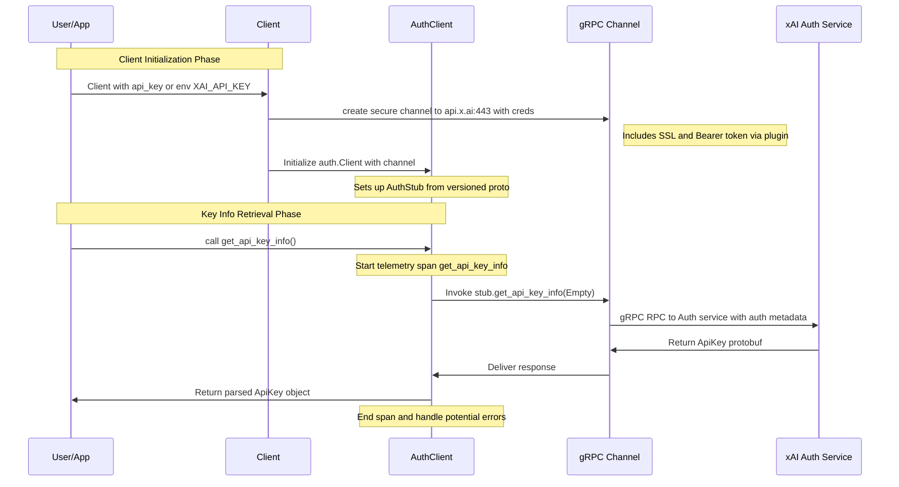

# High-Level Design: API Key Authentication Workflow

## Overview

The API Key Authentication workflow retrieves and displays detailed metadata about the authenticated API key used to interact with xAI's services. This includes user details (e.g., user_id, name), permissions (acls), timestamps (create_time, modify_time), team information, and status flags (api_key_blocked, team_blocked, disabled). 

The workflow starts with initializing the SDK's `Client` (synchronous) or `AsyncClient` (asynchronous) using an API key provided explicitly or via the `XAI_API_KEY` environment variable. This establishes a secure gRPC channel to `api.x.ai:443` with Bearer token authentication embedded in request metadata. The `client.auth.get_api_key_info()` method then performs a unary gRPC RPC to the Auth service, which validates the key and returns an `ApiKey` protobuf message. The response is typically printed to stdout in examples, showcasing redacted key, user info, etc.

This design ensures secure, efficient authentication verification, integrated with SDK's retry mechanisms, timeouts, and optional OpenTelemetry tracing. It supports API evolution through versioned protos (v5/v6, selected by protobuf version).

## Components

- **Main Client (`Client` / `AsyncClient`)**: Entry point in `src/xai_sdk/client.py` (base) and `src/xai_sdk/sync/client.py` / `aio/client.py`. Creates secure gRPC channels with composite credentials (SSL + metadata call credentials via `_APIAuthPlugin`). Initializes sub-clients like `self.auth = auth.Client(self._api_channel)`. Handles metadata injection (SDK version, Python version).

- **Auth Sub-Client (`auth.Client`)**: Defined in `src/xai_sdk/auth.py` (base) and `src/xai_sdk/sync/auth.py` / `aio/auth.py`. Inherits from `BaseClient`, initializes gRPC stub (`auth_pb2_grpc.AuthStub(channel)`) for the Auth service. Exposes `get_api_key_info()` which wraps the stub RPC in a telemetry span and returns `auth_pb2.ApiKey`.

- **gRPC Infrastructure**: 
  - Channel: Secure (TLS/SSL) to `api.x.ai`, with options for retries (5 attempts on UNAVAILABLE with exp backoff), timeouts (default ~27min), large message support (20MiB), keepalive.
  - Credentials: `grpc.ssl_channel_credentials()` + `grpc.metadata_call_credentials(_APIAuthPlugin)` which adds `("authorization", "Bearer <api_key>")` to every request metadata.
  - Interceptors: Implicit via plugin for auth; SDK metadata added.

- **Protobuf Layer** (`src/xai_sdk/proto/`): 
  - Imported dynamically from `v5` or `v6` based on `google.protobuf` major version (5 or 6) in `proto/__init__.py`.
  - Service: `Auth` with RPC `get_api_key_info(google.protobuf.Empty) returns (ApiKey)`.
  - `ApiKey` message: Fields include `redacted_api_key` (str), `user_id` (str), `name` (str), `create_time` / `modify_time` (Timestamp), `acls` (repeated str), `api_key_id` (str), `api_key_blocked` / `team_blocked` / `disabled` (bool), etc.

- **Telemetry (`src/xai_sdk/telemetry/`)**: Creates a `SpanKind.CLIENT` span named "get_api_key_info" around the RPC for observability, exporting to console/OTLP if configured.

- **Utilities**: Env var fallback in client init; error raising for missing/empty key.

## Sequence Diagram

## Additional Design Aspects

### Authentication Mechanism
The `_APIAuthPlugin` (gRPC `AuthMetadataPlugin`) is invoked per-request to inject authentication metadata. It combines user-provided metadata with the Bearer token, ensuring secure, stateless auth without session management. For localhost testing, falls back to local channel creds.

### Error Handling
- **Auth Failures**: gRPC `UNAUTHENTICATED` or `PERMISSION_DENIED` if key invalid/blocked; raised as gRPC exceptions.
- **Connectivity**: Retries only on `UNAVAILABLE`; other transient errors may fail immediately.
- **Client-Side Validation**: `ValueError` if api_key missing/empty during init.
- **Proto Compatibility**: Dynamic import ensures works with protobuf 5.x or 6.x; unsupported versions raise `ValueError`.

### Observability and Extensibility
- Traces capture RPC details; customizable via `TracerProvider`.
- Metadata includes SDK/Python versions for server-side logging.
- Supports custom channel options, metadata, timeouts for advanced configs.
- Dual sync/async: Identical interface, differing only in blocking vs. await.

### Integration in SDK Architecture
This workflow exemplifies the SDK's layered design: User layer (Client methods) → Abstraction (sub-clients) → gRPC (stubs/RPCs) → Proto (messages). Shared with other services (chat, files, etc.) via common channel and auth setup.

### Example Usage Flow
In `examples/sync/auth.py`: Init client → Call `get_api_key_info()` → Print fields (e.g., `print(f"User ID: {api_key_info.user_id}")`). Mirrors tests in `tests/sync/auth_test.py` validating response and spans.