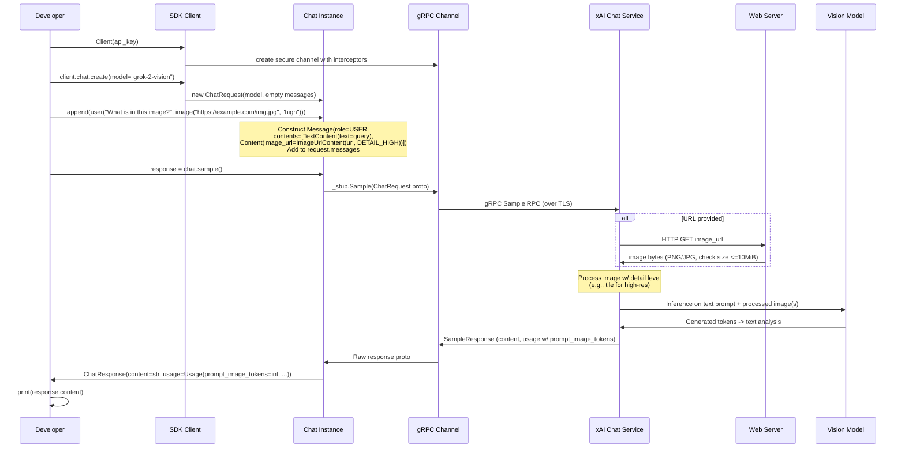

# Design Workflow #10: Image Understanding

## Overview

The Image Understanding workflow enables developers to integrate image analysis into chat conversations using vision-capable models from xAI. By attaching images to user messages via URLs or base64 data URIs, users can query the model for descriptions, answers to questions about the image content, identification of objects, or comparisons between multiple images.

This feature leverages the chat API, where images are treated as content types within messages. The SDK provides helper functions to simplify protobuf construction, handling details like image detail levels which affect processing resolution and token consumption. Responses include the model's textual analysis and usage statistics, highlighting image-specific token counts for cost and limit awareness.

The workflow supports both synchronous and asynchronous operations, multi-turn conversations, and integration with other SDK features like streaming, tools, and structured outputs. It abstracts away gRPC complexities, focusing on ease of use while maintaining type safety via Pydantic and proto wrappers.

## Components

### Core SDK Components
- **Client / AsyncClient** (`src/xai_sdk/client.py`, `src/xai_sdk/sync/client.py`, `src/xai_sdk/aio/client.py`): Main entry points that set up gRPC channels with authentication (API key as Bearer token in metadata), interceptors for auth/timeouts, retries, and optional OpenTelemetry tracing. Sub-clients for services including chat are lazily initialized.
- **BaseClient for Chat** (`src/xai_sdk/chat.py`): Abstract base with `_stub: ChatStub` for gRPC interactions. Implements `create()` to produce mutable `Chat` instances (sync or async).
- **Chat Instance** (concrete in sync/aio/chat.py): Holds `ChatRequest` proto, manages message history via `append()`, and executes via `sample()`, `stream()`, etc., wrapping responses.

### Message and Content Builders (`src/xai_sdk/chat.py`)
- **`image(image_url: str, *, detail: Optional[ImageDetail] = "auto") -> chat_pb2.Content`**: Constructs image content.
  - Accepts HTTP(S) URLs or data URIs (e.g., `data:image/jpeg;base64,...`).
  - `detail` (from `types/chat.py`): "auto" (model chooses), "low" (fast, low-res, fewer tokens), "high" (detailed, high-res, more tokens/time).
  - Maps to `chat_pb2.Content(image_url=image_pb2.ImageUrlContent(image_url=..., detail=ImageDetail enum))`.
  - Docs note: URLs fetched server-side per request (no caching); max 10 MiB; PNG/JPG supported; failures propagate as gRPC errors.
- **`user(*args: Content) -> chat_pb2.Message`**: Creates `Message(role="user", contents=[converted args])`, where `Content` is str (to TextContent) or proto Content (e.g., image).
- Analogous `system()`, `assistant()` for other roles.
- Supports multi-content messages: e.g., text + multiple images interleaved.

### Protocol Definitions (Generated `src/xai_sdk/proto/v5/chat_pb2.py` et al.)
- `chat_pb2.ChatRequest`: model (e.g., "grok-2-vision"), messages (list of Message), sampling params (temperature, max_tokens, etc.), tools, search params, etc.
- `chat_pb2.Message`: role (user/system/etc.), contents (repeated Content), optional tool_calls.
- `chat_pb2.Content`: oneof-like with text or image_url (or other types).
- `image_pb2.ImageUrlContent`: image_url (str), detail (enum: DETAIL_AUTO/LOW/HIGH).
- `chat_pb2.SampleResponse`: choices (with finish_reason, message (assistant)), usage (prompt_tokens, prompt_image_tokens, etc.), optional stored_completion_id.
- Versioned protos (v5/v6) allow API evolution; SDK selects based on features.

### Backend Services
- **xAI Chat Service**: Processes requests via gRPC RPCs (Sample, StreamSample). For vision: fetches image from URL if provided, applies detail level (e.g., resizing/tiling), embeds into prompt for vision model inference.
- **Vision Models**: Specialized models like "grok-2-vision" (discoverable via models.list_language_models() filtering image capabilities).
- **External Dependencies**: Web servers for URL image fetching (server-side).

### Supporting Modules
- **Types** (`src/xai_sdk/types/chat.py`): `ImageDetail` TypeAlias for literals; other chat enums.
- **Telemetry** (`src/xai_sdk/telemetry/`): Traces spans for chat calls, attributes include model, prompts (if not disabled), usage.image_tokens; exports to console/OTLP.
- **Interceptors** (`src/xai_sdk/interceptors.py`): AuthInterceptor adds API key; others for metadata/telemetry.
- **Examples** (`examples/(aio/)sync/image_understanding.py`): Demonstrate URL multi-image query and base64 embedding (client fetches via requests/aiohttp).
- **Tests** (`tests/(aio/)sync/image_test.py`? Wait, layout has image_test.py under aio/sync, but likely tests chat with images.

## Sequence Diagram: Core Flow for URL-based Image Understanding

**Notes on Diagram:**
- For base64 data URIs, skip server fetch; image data is already in proto payload.
- Telemetry spans wrap the sample() call, capturing request/response attrs.
- Multi-turn: Additional `append(response)` + `sample()` continues conversation with history.
- Streaming: Use `stream()` for real-time token output.
- Error paths (e.g., fetch fail, invalid image) return gRPC status with details.

## Variations and Extensions

### Base64 Embedding
Client-side: Fetch image (requests/aiohttp), base64 encode, prefix "data:image/{mime};base64," -> pass to `image()`. Increases request size but avoids server fetch latency/reliability issues.

### Multi-Image and Complex Queries
Messages support multiple `image()` calls; model processes all in context. E.g., "Compare these two images" with two URLs.

### Integration with Other Features
- **Tools/Function Calling**: Attach tools to chat for agentic image analysis (e.g., search related info).
- **Structured Outputs**: Use `response_format` or `parse(Model)` for JSON schemas extracting image attributes (e.g., {"objects": [...]}).
- **Search**: Enable `search_parameters` for real-time web context in analysis.
- **Deferred/Stored**: For long computations; store for continuation.
- **Files**: Potentially upload via files API, reference file_id in messages? (Check proto for support).

### Performance and Limits
- **Tokens**: Images tokenized based on processed size/detail; reported in usage for billing/limits.
- **Detail Trade-offs**: "low" optimizes speed/cost; "high" for fine details (e.g., text in images).
- **Concurrency**: AsyncClient for non-blocking; sync for simple scripts.
- **Reliability**: Retries on UNAVAILABLE; timeouts configurable.

## Design Decisions
- **Server vs Client Fetch**: URLs server-fetched for simplicity (no client HTTP dep core), but base64 option for flexibility.
- **Proto Abstraction**: Helpers like `image()`, `user()` hide pb2 details, convert strings/enums seamlessly.
- **Vision via Chat**: Unified chat API for text+image, avoiding separate image API for understanding (generation has dedicated image service).
- **Type Safety**: Literals and Pydantic ensure valid inputs; proto decorators add Pythonic props/methods.
- **Observability**: Image tokens traced for monitoring vision workload.

This design aligns with SDK's modular, gRPC-centric architecture, providing intuitive APIs over powerful backend capabilities.
