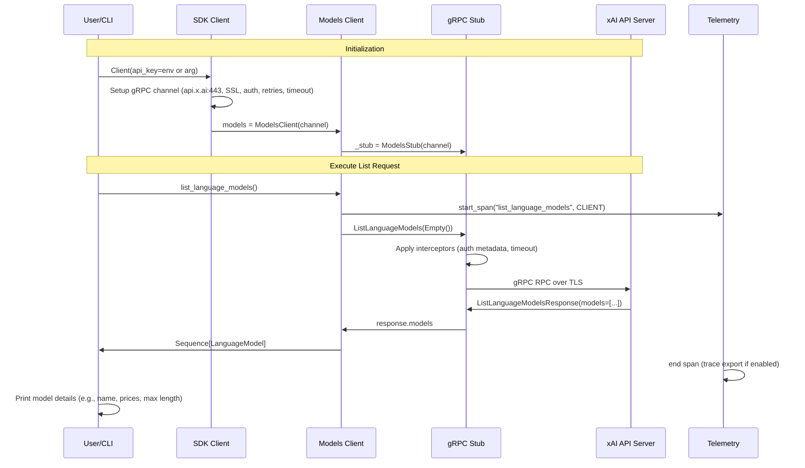
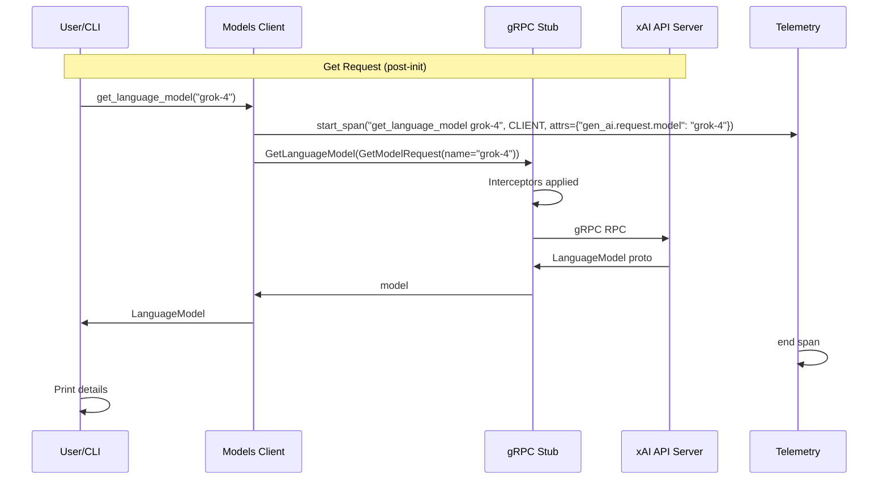

# High-Level Design: Models Information Workflow (#11)

## Overview

The Models Information workflow enables retrieval of metadata for models available via the xAI API, including language, embedding, and image generation models. Users can list all models associated with their API key or fetch details for a specific model by name. This supports discovery of model capabilities, pricing, input/output modalities, limits (e.g., max prompt length), and other attributes like version and system fingerprint.

Implemented in the SDK's `models` sub-module, the workflow integrates with the core client architecture for gRPC communication, authentication, retries, and telemetry. Example scripts in `examples/sync/models.py` and `examples/aio/models.py` provide CLI interfaces using `absl.flags` for operations like `--operation list/get`, `--model-type` (language/embedding/image), and `--model-name`. These scripts create a `Client`, invoke methods like `client.models.list_language_models()`, and print proto message fields to stdout.

The design emphasizes simplicity, type safety via protobufs, observability through spans, and resilience with built-in retries and timeouts.

## Key Components

- **Main Client (`Client` / `AsyncClient`)**: Entry point (`src/xai_sdk/sync/client.py` / `aio/client.py`). Handles API key (from env `XAI_API_KEY` or arg), creates secure gRPC channels to `api.x.ai:443` with SSL/TLS, Bearer token auth via metadata plugin or interceptor, default channel options (e.g., 20MiB message limits, keepalive), retry policy (5 attempts on UNAVAILABLE with backoff), and timeout (default 15min). Instantiates sub-clients including `models`.

- **Models Sub-Client**: `src/xai_sdk/sync/models.py` / `aio/models.py`. Extends `BaseClient` (`src/xai_sdk/models.py`) to create `ModelsStub`. Exposes methods:
  - `list_language_models()` → `Sequence[LanguageModel]`
  - `get_language_model(name: str)` → `LanguageModel`
  - Similar for `embedding_models` and `image_generation_models`.
  Methods wrap gRPC calls with telemetry spans (e.g., span name `"list_language_models"`, attributes for get ops).

- **gRPC and Protos**: Leverages `grpcio` and generated stubs from `proto/v6/models_pb2_grpc.py` (or v5). RPCs include `ListLanguageModels(google.protobuf.Empty) returns ListLanguageModelsResponse` with `repeated LanguageModel models`. Model protos define fields like `name`, `aliases`, `version`, `input_modalities`, `output_modalities`, price fields (e.g., `prompt_text_token_price` as Money proto), `max_prompt_length`, `created` (Timestamp), `system_fingerprint`.

- **Interceptors (`src/xai_sdk/interceptors.py`)**: `AuthInterceptor` adds `authorization: Bearer <key>`; `TimeoutInterceptor` enforces per-RPC deadlines.

- **Telemetry (`src/xai_sdk/telemetry/`)**: Uses OpenTelemetry SDK to create CLIENT-kind spans per method, capturing operation details for export to console/OTLP. Optional, configured separately.

- **Example Implementation**: CLI parses inputs, handles sync/async, prints details (e.g., prices, modalities). Tests in `tests/sync/models_test.py` / `aio/` validate functionality and spans.

- **Types (`src/xai_sdk/types/model.py`)**: Type aliases (e.g., `ChatModel = Literal["grok-4", ...]`) for static checking of model names in user code.

## Sequence Diagram: Listing Language Models

## Sequence Diagram: Getting Specific Model

The flow mirrors listing but with differences noted:

- User input includes `--model-name <name>`
- Method: `get_language_model(name)`
- Span: `name=f"get_language_model {name}"`, attributes `{"gen_ai.request.model": name}`
- gRPC: `GetLanguageModel(GetModelRequest(name=name))` → single `LanguageModel`
- Error if model not found (e.g., NOT_FOUND status)

## Additional Design Aspects

### Data Models and Flow
- Protos ensure schema enforcement; users iterate over lists or access fields directly (e.g., `model.prompt_text_token_price`).
- No client-side caching; fresh data from API per call, reflecting updates to model availability/pricing.
- Supports API versioning via separate proto dirs (v5/v6); client likely selects based on init params or defaults to latest.

### Resilience and Observability
- **Retries**: Configurable via service config JSON; targets transient UNAVAILABLE errors.
- **Timeouts**: Per-channel/RPC, preventing hangs on slow responses.
- **Tracing**: Spans link to broader request traces (e.g., if called within chat workflow), with GenAI conventions.
- **Errors**: gRPC statuses exposed (e.g., PERMISSION_DENIED for insufficient ACLs, RESOURCE_EXHAUSTED for quotas).

### Usage in Broader SDK
- Model info informs other workflows (e.g., selecting valid `model` param in `chat.create()`).
- Integrates with `types.model.py` for autocomplete/type checking.
- Examples demonstrate printing comprehensive info, aiding debugging and integration.

### Potential Extensions
- Add Pydantic wrappers for model protos to enable structured outputs/validation.
- Client-side caching with TTL for frequent lists.
- Pagination support if API scales to many models (current lists are small).

This document is derived from codebase analysis including client.py, models.py (sync/aio/base), examples/sync/models.py, proto/models_pb2*, interceptors.py, and telemetry modules.