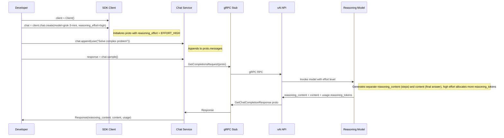
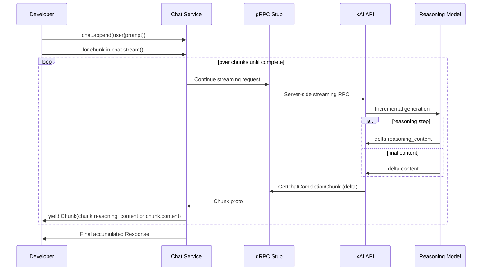

# High-Level Design: Workflow #12 - Reasoning Tasks

## Overview

The Reasoning Tasks workflow utilizes xAI's reasoning-capable models to handle complex problem-solving by configuring the `reasoning_effort` parameter (\"low\" or \"high\"). This controls the depth of reasoning, with responses providing separate `reasoning_content` (step-by-step thoughts) and `content` (final answer), plus dedicated `reasoning_tokens` in usage.

Supported via sync and aio clients, multi-turn chats, streaming for real-time observation of reasoning. Examples in `examples/*/reasoning.py` demonstrate CLI interaction with flags for stream and effort.

Integration with telemetry captures reasoning attributes for observability. Requires reasoning models like \"grok-3-mini\" or those suffixed with \"-reasoning\".

## Components

### Core SDK Components
- **Client**: `Client()` sets up gRPC channel with auth, retries.
- **Chat Client**: `client.chat` (BaseClient) creates `BaseChat` wrapping `GetCompletionsRequest`.
  - Key param: `reasoning_effort` converted to `chat_pb2.ReasoningEffort` (EFFORT_LOW/HIGH).
- **Chat Instance (`BaseChat`)**: Manages `proto.messages`, `append()` preserves `reasoning_content` from responses.
- **Response/Chunk**: Accessors for `reasoning_content`, `content`; buffering in streaming.
- **Types**: `ReasoningEffort` Literal in `types/chat.py`; models in `types/model.py`.

### Protobuf Definitions (v5/v6/chat_pb2)
- Request: `reasoning_effort` enum.
- Message/Output: `reasoning_content: str`.
- Usage: `reasoning_tokens: int`.
- Supports `use_encrypted_content` for encrypted traces.

### Examples & Tests
- `examples/sync/reasoning.py`: Sync/stream sample, print reasoning/final/usage.
- `tests/sync/chat_test.py`: Tests effort conversion, content parsing, invalid handling.

### Telemetry & Utils
- Span attrs: `gen_ai.request.reasoning_effort`, `gen_ai.usage.reasoning_tokens`.
- PollTimer not directly used; deferred chats may integrate.

## Sequence Diagrams

### Synchronous Flow

### Streaming Flow

## Other High-Level Aspects
- **Effort Impact**: Low: quick, shallow; High: thorough, costlier in tokens/latency.
- **Model Compatibility**: Queried via `client.models`; non-reasoning models may default or ignore.
- **Conversation Continuity**: Append responses to carry reasoning_content; encrypted for privacy.
- **Edge Cases**: Invalid effort -> ValueError; empty reasoning if model doesn't support.
- **Versioning**: Protos in v5/v6; SDK abstracts.
- **Dependencies**: grpcio, protobuf; optional opentelemetry for traces.

This design promotes transparency in AI reasoning while maintaining efficient, type-safe Pythonic API.
