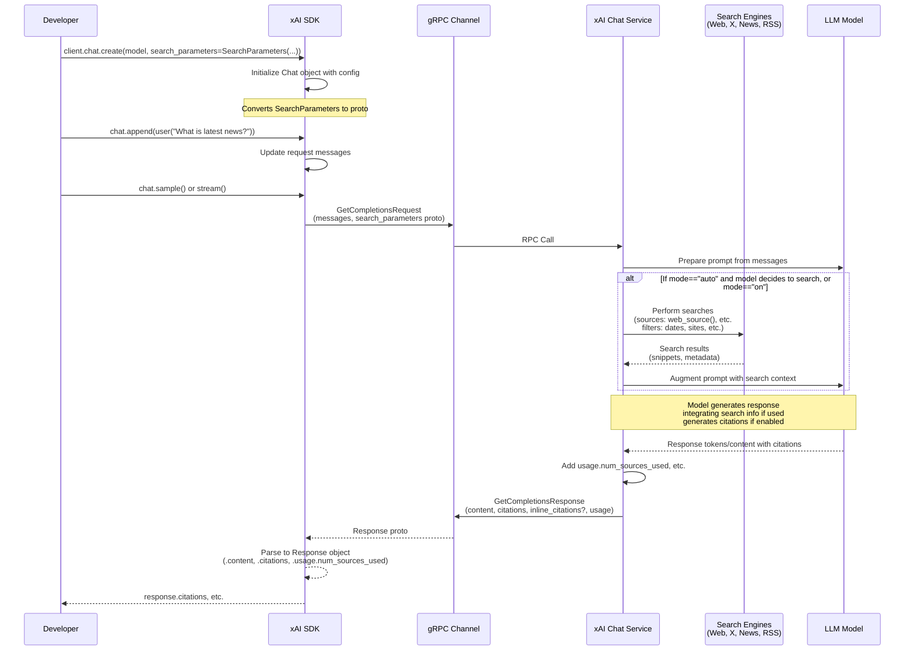
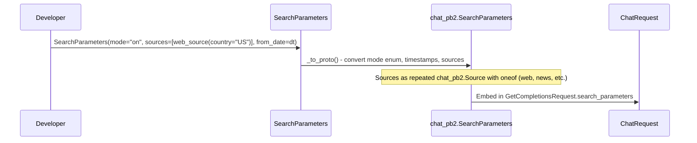

# High-Level Design: Search Integration Workflow (#13)

## Overview

The Search Integration workflow enables developers to incorporate real-time search from external sources into chat completions via the xAI Python SDK. By providing `SearchParameters` to `client.chat.create()`, users configure how the xAI Chat Service performs searches during response generation. Supported sources include web, news, X (formerly Twitter), and RSS feeds, with options for modes (\"auto\", \"on\", \"off\"), date ranges, site inclusions/exclusions, safe search, and citation return.

During a chat `sample()` or `stream()`, the SDK serializes parameters into the gRPC `GetCompletionsRequest`. The server-side service evaluates the mode: in \"auto\", the model decides if search is needed; in \"on\", it always searches specified sources; \"off\" disables it. Searches fetch relevant data (e.g., snippets, posts) filtered by config, augment the prompt for the LLM, and generate responses grounded in current information. Outputs include content, citations (source domains), optional inline citations (with text positions and details), and `usage.num_sources_used`.

This server-side RAG-like mechanism ensures responses reflect real-time data beyond the model's training, with transparency via citations. Defaults favor web and X sources if unspecified, and citations are enabled by default.

## Components

### Client-Side (SDK)
- **SearchParameters** (`src/xai_sdk/search.py`): Dataclass for config:
  - `mode`: SearchMode (\"auto\" model-decided, \"on\" always, \"off\" disabled).
  - `sources`: Optional list of `chat_pb2.Source`; helpers create these:
    - `web_source()`: Country, excluded/allowed websites (max 5), safe_search.
    - `news_source()`: Similar to web, for news-specific results.
    - `x_source()`: Included/excluded handles, min favorite/view counts.
    - `rss_source(links)`: Specific RSS feed URLs.
  - `from_date`/`to_date`: Optional datetimes for recency.
  - `return_citations`: Bool (default True) for including source domains.
  - `max_search_results`: Optional int (default 15) to limit results.
  - Internally converts to proto via `_to_proto()`.
- **Chat API** (`src/xai_sdk/chat.py`): 
  - `create()` accepts `search_parameters`, converts if needed, stores in request.
  - `sample()`/`stream()` sends via `ChatStub` gRPC, parses response to objects with `.citations` (list[str]), `.inline_citations` (list[InlineCitation] if `include=[\"inline_citations\"]`), `usage.num_sources_used`.
- **Types** (`src/xai_sdk/types/chat.py`): Enums like IncludeOption for \"inline_citations\".

### Protocol Definitions (Generated `src/xai_sdk/proto/v5|6/chat_pb2.py`)
- `SearchParameters`: Fields for mode enum, repeated sources, timestamps, return_citations, max_results.
- `Source` oneofs: WebSource/NewsSource/XSource/RssSource with filters.
- Response fields: `citations` (repeated str), inline citations with positions and typed citations (WebCitation, etc.).
- Request/Response integrate with broader chat proto.

### Server-Side (xAI Infrastructure)
- **Chat Service**: Orchestrates request processing, search triggering, result integration.
- **Search Integrations**: Queries external APIs (e.g., web search engines, Twitter API, news feeds, RSS).
- **LLM Inference**: Uses augmented context to generate cited responses.

### Examples
- `examples/sync/search.py`: Demos modes, sources, dates, streaming; prints content, citations, sources used.
- Similar in `aio/`.

## Sequence Diagram: Core Flow

## Additional Diagrams

### Source Configuration Flow

## Design Decisions and Considerations
- **Server-Side Search**: Offloads complexity/cost from client; SDK only configures.
- **Flexibility**: Granular source controls (e.g., handle filters for X) for targeted searches.
- **Modes**: Balance between always-search latency and on-demand relevance.
- **Citations**: Promote trust/transparency; inline for precise attribution.
- **Validation**: SDK validates enums; server enforces limits (e.g., max 5 sites).
- **Edge Cases**: No sources → defaults to web+X; "off" ignores params; empty results → fallback to model knowledge.
- **Telemetry**: Traces include search params, sources used (if enabled).
- **Versioning**: Supported in proto v5/v6; SDK selects based on model/API.

## Relevant Files
- Core: `src/xai_sdk/search.py`, `src/xai_sdk/chat.py`
- Proto: `src/xai_sdk/proto/v*/chat_pb2.py` (generated)
- Examples: `examples/*/search.py`
- Tests: `tests/*/chat_test.py` (search-related)

This design provides a robust, configurable interface for enhancing chat responses with external knowledge.