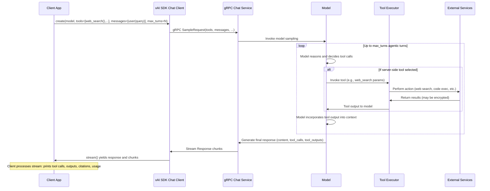
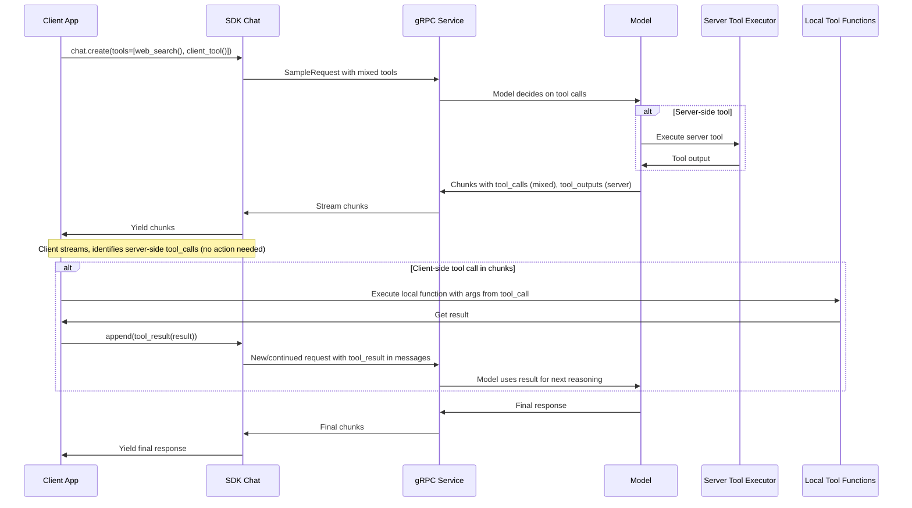

# Design Workflow 14: Server-Side Tools

## Overview

The Server-Side Tools workflow enables the integration of xAI-provided server-side tools into chat completions, allowing the model to autonomously perform actions such as web searching, searching X (formerly Twitter), executing code, and searching collections during agentic conversations. These tools are defined in the SDK as protobuf `Tool` objects and passed to the `chat.create()` method. Unlike client-side function tools, which require local execution by the client, server-side tools are executed entirely on the xAI backend, with results streamed back to the client via the response chunks.

This design supports agentic workflows where the model can make multiple tool calls across turns (controlled by `max_turns`), incorporate results into reasoning, and produce a final response with citations and usage details. It also allows mixing with client-side tools for hybrid agent behaviors. Key features include handling encrypted content for privacy-compliant continuations and server-side storage for persistent conversations. The workflow emphasizes low-latency streaming, observability via telemetry, and configurability for tool parameters.

The entry points are tool factory functions like `web_search()`, `x_search()`, and `code_execution()` in `tools.py`, used in `chat.py`'s `create()` and `stream()` methods. Relevant protobufs are in `proto/v5/chat_pb2.py` and `v6/`.

## Components

- **Tool Factory Functions (`src/xai_sdk/tools.py`)**:
  - `web_search(excluded_domains, allowed_domains, enable_image_understanding)`: Configures web search tool with domain filters and image analysis.
  - `x_search(from_date, to_date, allowed_x_handles, enable_image/video_understanding)`: X/Twitter search with temporal and user filters.
  - `code_execution()`: Enables server-side code execution for computations.
  - `collections_search(collection_ids, limit, instructions, retrieval_mode)`: Searches vector collections with hybrid/semantic/keyword modes.
  - `mcp(server_url, ...)`: Connects to remote MCP servers for additional tools.
  - `get_tool_call_type(tool_call)`: Identifies tool types (e.g., "web_search_tool", "client_side_tool").

- **Chat API (`src/xai_sdk/chat.py`)**:
  - `BaseClient.create(model, tools, tool_choice, parallel_tool_calls, max_turns, use_encrypted_content, store_messages, previous_response_id, include, ...)`: Initializes chat request with tool support and agentic params.
  - `chat.stream()`: Yields `(response, chunk)` where `chunk` contains `tool_calls`, `tool_outputs`; `response` has `content`, `citations`, `usage`, `server_side_tool_usage`, `tool_calls`.
  - `chat.append(message or response or tool_result)`: Continues conversation, automatically handling encrypted content.

- **Search Integration (`src/xai_sdk/search.py`)**: While separate, complements tools via `SearchParameters` for integrated search in chat (not explicit tool calls).

- **Examples (`examples/sync/server_side_tools.py`, `aio/server_side_tools.py`)**: Demonstrate pure server-side agentic search, mixed tools with local execution loops using encrypted content or stored IDs.

- **Protobuf Layer (`src/xai_sdk/proto/v*/chat_pb2.py`)**: Defines `Tool`, `ToolCall`, `ToolOutput`, `SearchParameters`, etc., for gRPC serialization.

- **Interceptors and Client (`src/xai_sdk/client.py`, `interceptors.py`)**: Handle auth, retries, metadata for gRPC calls.

- **Telemetry (`src/xai_sdk/telemetry/`)**: Traces tool invocations, with spans for each call including inputs/outputs (sensitive data optional).

## Sequence Diagrams

### Pure Server-Side Agentic Workflow

This diagram illustrates the flow for a chat request using only server-side tools, where the server manages agentic loops.

### Mixed Client-Side and Server-Side Tools Workflow

This shows hybrid usage, where client executes its tools locally and feeds results back.

## Additional Design Aspects

- **Agentic Control**: `max_turns` limits server-side iterations; `parallel_tool_calls` allows multiple simultaneous calls per turn. `tool_choice` forces specific tools or auto/none/required modes.

- **Privacy and Continuity**:
  - `use_encrypted_content=True`: Encrypts reasoning/tool outputs for ZDR users; SDK auto-passes in appends.
  - `store_messages=True` + `previous_response_id`: Persists and branches conversations server-side (not for ZDR).

- **Output Inclusion (`include` param)**: Options like `"verbose_streaming"`, `"code_execution_call_output"`, `"web_search_call_output"` for detailed logging.

- **Customization and Limits**: Tools support params (e.g., date ranges, domains); limits enforced (e.g., max 10 collections, 5 domains). Errors surface via gRPC statuses.

- **Observability**: Integrated with OpenTelemetry; spans capture tool types, calls, usage (tokens, server-side tool stats). Sensitive data export configurable.

- **Streaming and State**: Client maintains conversation state via `chat.messages`; server stateless per request but supports continuity via IDs/encryption.

- **Error Resilience**: Client's `BaseClient` handles retries/timeouts; tools may fail gracefully with outputs indicating issues.

This design leverages gRPC streaming for real-time agentic interactions, balancing power with privacy and configurability.