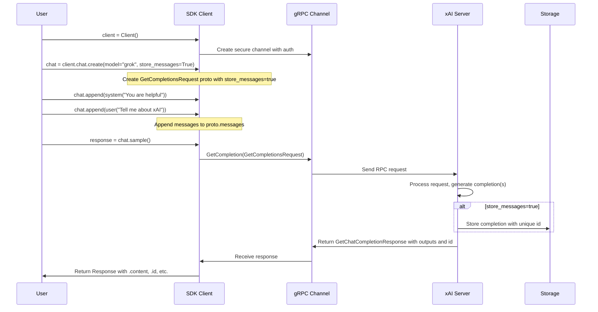
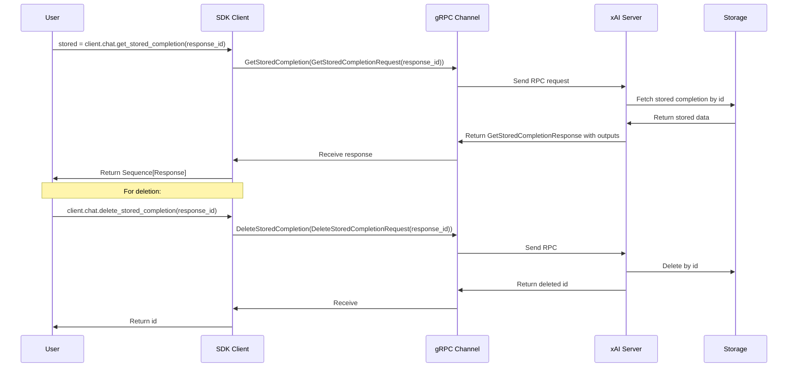
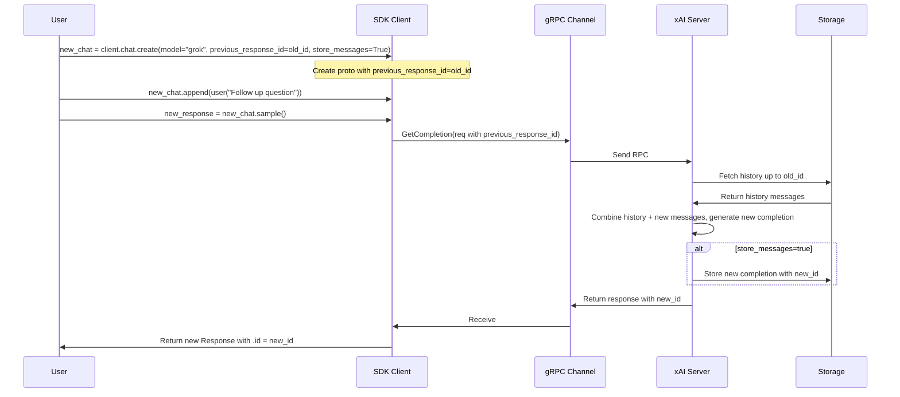

# Design Workflow #15: Stored Chat Sessions

## Overview
The Stored Chat Sessions workflow provides mechanisms for persisting and managing chat completions on the xAI backend, enabling long-term conversation continuity, branching, and retrieval without relying on client-side state. Key features include:

- **Storage**: Set `store_messages=True` in `client.chat.create()` to automatically store generated responses with unique IDs upon sampling.
- **Continuation**: Use `previous_response_id` (from a stored `Response.id`) in new chat instances to prepend server-fetched history, allowing seamless multi-turn or branched sessions.
- **Retrieval**: `client.chat.get_stored_completion(response_id)` fetches stored response(s), supporting single or batch (e.g., from `sample_batch()`).
- **Deletion**: `client.chat.delete_stored_completion(response_id)` removes stored data permanently.
- **Constraints**: Unavailable for users/teams with Zero Data Retention (ZDR) enabled. Integrates with other features like tools, streaming, structured outputs, and deferred requests.
- **Use Cases**: Agentic workflows, persistent assistants, historical analysis of conversations.

This design leverages gRPC for efficient RPCs, protobuf for typed contracts, and server-side storage for scalability. Telemetry traces operations with attributes like `gen_ai.request.store_messages` and `gen_ai.request.previous_response_id`.

## Components
- **SDK Client (sync/aio)**: Main interface (`Client`/`AsyncClient`). Hosts `chat` sub-client implementing storage RPCs via gRPC stubs.
- **Chat Classes**: `BaseChat` wraps `GetCompletionsRequest` proto; `Chat`/`AsyncChat` add sampling methods. Handle local message appending; propagate `store_messages` and `previous_response_id` to proto.
- **Protobuf Messages/Services**:
  - `GetCompletionsRequest`: Core request with `messages`, `model`, `store_messages: bool`, `previous_response_id: str`.
  - `GetStoredCompletionRequest/Response`: For retrieval, response includes `outputs` for potential batch.
  - `DeleteStoredCompletionRequest/Response`: Simple ID-based deletion.
- **gRPC Infrastructure**: `ChatStub` for RPCs (`GetCompletion`, `GetStoredCompletion`, `DeleteStoredCompletion`). Channels secured with TLS, auth interceptors.
- **Server-Side Logic**: Processes requests, generates completions (possibly with tools/search), stores/retrieves from backend DB/storage, handles history prepending for continuations.
- **Models & Types**: `Response` (Pydantic) includes `.id`; supports batch via `Sequence[Response]`.
- **Utilities**: Telemetry for observability; poll timers for deferred if combined.
- **Examples & Tests**: Usage in `examples/{sync,aio}/stored_chat.py`; tested in `tests/{sync,aio}/chat_test.py` for retrieval (single/batch), deletion, errors.

## Sequence Diagrams

### Storing a Chat Completion

### Retrieving and Deleting Stored Completions

### Continuing a Stored Chat Session

## Additional Design Aspects
- **Conversation Branching**: `previous_response_id` allows forking from any stored point; server prepends full prior history transparently.
- **Batch Handling**: Batch methods (e.g., `sample_batch(n)`) generate/store multiple outputs; retrieval returns all via single RPC.
- **Local vs. Server State**: Local `chat.messages` not updated by `previous_response_id`; users manage manually if needed (e.g., append retrieved responses).
- **Error Resilience**: gRPC status codes (e.g., NOT_FOUND for invalid IDs); SDK retries on transients.
- **Observability**: OpenTelemetry spans capture request params (store_messages, previous_response_id) and response metrics (tokens, etc.).
- **Compatibility**: Works across proto versions (v5/v6); optional with other params like tools, search_parameters.
- **Limitations**: Storage incurs backend costs/quotas; ZDR users fallback to `use_encrypted_content` for reasoning continuity.
- **Future-Proofing**: Deprecations noted (e.g., batch methods favor single with n=1); extensible via proto evolution.