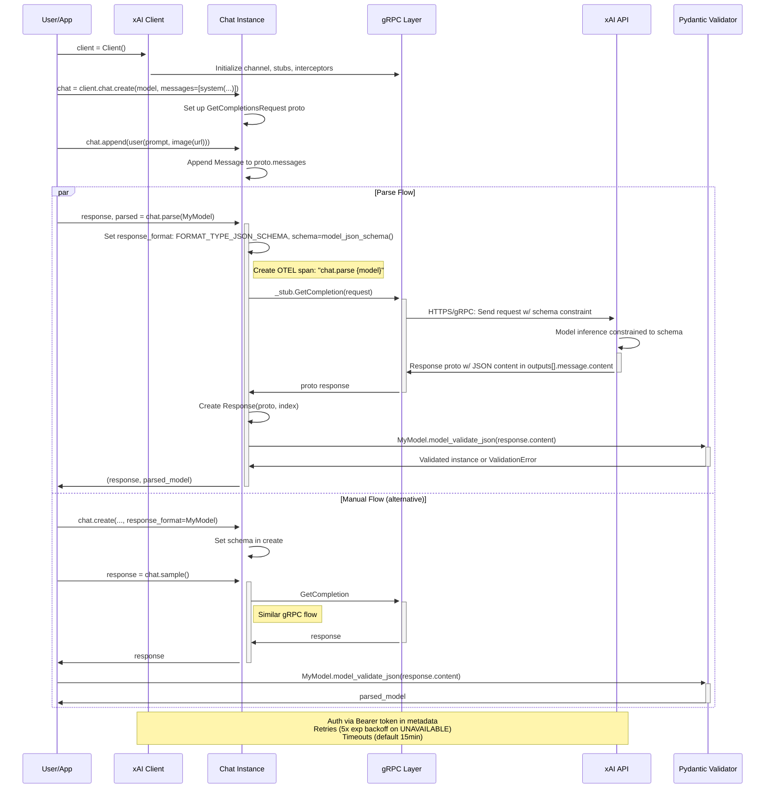
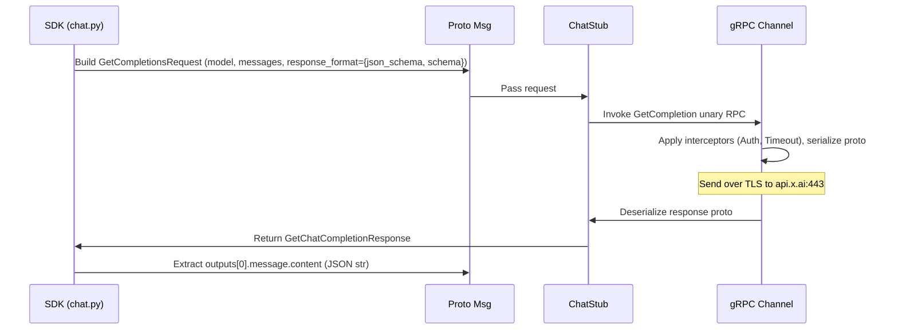

# High-Level Design: Structured Outputs Workflow (#16)

## Overview

The Structured Outputs workflow in the xAI Python SDK allows developers to generate model responses that adhere to a predefined JSON structure, defined using Pydantic `BaseModel` subclasses. By providing a JSON schema derived from the Pydantic model to the chat API via the `response_format` parameter (set to `FORMAT_TYPE_JSON_SCHEMA`), the model is constrained to output valid JSON matching the schema. The SDK then parses this JSON into a type-safe Pydantic instance, enabling reliable extraction of structured data from prompts, including multimodal inputs like images.

This feature is integrated into the chat API, supporting both synchronous (`sync/chat.py`) and asynchronous (`aio/chat.py`) modes. It is demonstrated in examples such as `examples/sync/structured_outputs.py`, where it extracts receipt details (date, items, total) from an image using vision models like `grok-2-vision`.

Key aspects:
- **Schema Enforcement**: Model generates compliant JSON; non-compliance may result in invalid output requiring manual handling.
- **Use Cases**: Data extraction (e.g., forms, receipts), agentic workflows needing typed outputs, API integrations.
- **Limitations**: Relies on model adherence to schema; streaming requires manual content accumulation before parsing; validation is client-side via Pydantic.

## Components

- **Pydantic Models**: User-defined `BaseModel` subclasses (e.g., `class Receipt(BaseModel): date: datetime; items: list[Item]; ...`). Provides schema via `model_json_schema()` for API constraint and `model_validate_json()` for parsing.
- **Chat Creation (`BaseClient.create`)**: Accepts `response_format: Union[ResponseFormat, type[BaseModel]]`. If `BaseModel`, converts to `chat_pb2.ResponseFormat(format_type=FORMAT_TYPE_JSON_SCHEMA, schema=json.dumps(schema))`.
- **Parse Method (`Chat.parse` in sync/aio)**: Convenience wrapper—sets schema on `proto.response_format`, invokes `sample()` (gRPC `GetCompletion`), creates `Response`, parses content, returns `(Response, T)`.
- **Response Class**: Wraps `chat_pb2.GetChatCompletionResponse`; exposes `content` (JSON string), `usage` (tokens), `tool_calls`, etc. Buffers chunks for streaming if used.
- **Proto Definitions (`proto/v*/chat_pb2.py`)**: `GetCompletionsRequest` includes `response_format`; supports versioning (v5/v6).
- **Utility Layers**: Telemetry (OpenTelemetry spans with GenAI attrs like `gen_ai.request.model`, prompts/responses if enabled); interceptors (auth, timeouts); poll_timer for deferred (not directly used here).
- **Types (`types/chat.py`)**: `ResponseFormat` excludes "json_schema" to encourage `parse`; other types like `Content` for messages (text, image, file).
- **Examples & Tests**: `examples/*/structured_outputs.py` shows parse vs. manual; tests in `tests/*/chat_test.py` likely cover schema setting/parsing.

## Sequence Diagram: Core Flow (Parse Method)

## Additional Diagrams

### gRPC Proto Interaction

## Other High-Level Design Aspects

- **Integration with Other Features**:
  - **Multimodal**: Supports image/file contents in messages for vision-based extraction (e.g., `image(url, detail="high")` adds ~tokens based on resolution).
  - **Tools/Functions**: Schema applies to assistant message; can combine with `tools` for hybrid workflows.
  - **Streaming**: `chat.stream()` yields chunks; accumulate `chunk.content` then parse (not in `parse`, which is non-streaming).
  - **Deferred/Stored**: Can use `defer()` for long tasks; `store_messages=True` for persistence, but schema unchanged.

- **Error & Resilience**:
  - **Validation**: Pydantic raises `ValidationError` on mismatch; handle via try/except or `model_validate_json` strict mode.
  - **API Errors**: gRPC statuses (e.g., INVALID_ARGUMENT if schema invalid, RESOURCE_EXHAUSTED for quotas).
  - **Fallbacks**: If schema fails, fallback to "json_object" or "text"; monitor via telemetry.

- **Performance Considerations**:
  - Schema size adds to prompt tokens; complex nested models increase latency/tokens.
  - Client-side parsing overhead minimal; model enforcement reduces post-processing.

- **Versioning & Compatibility**:
  - Proto v5/v6 support; newer versions may enhance schema features.
  - Pydantic v2+ assumed (via deps); schema evolution via model updates.

- **Observability**:
  - OTEL spans capture request attrs (model, temp, schema type), response (tokens, content if not disabled via env).
  - Custom attrs for structured outputs traceable via `gen_ai.output.type: "json_schema"`.

This design leverages gRPC efficiency, Pydantic ergonomics, and model capabilities for robust structured generation in Python apps.