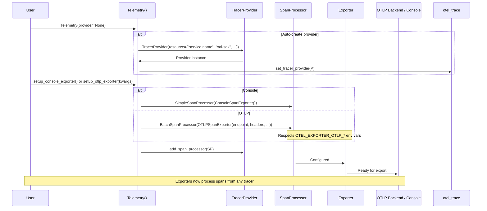
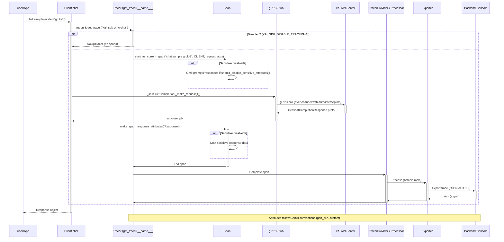

# High-Level Design: Telemetry and Observability Workflow

## Overview

The Telemetry and Observability workflow in the xAI Python SDK integrates OpenTelemetry for distributed tracing of API interactions. This enables developers to monitor, debug, and analyze the performance, errors, and data flow of SDK operations such as chat completions, image generation, file management, and more. Traces are exported to console for local development or to OTLP-compatible backends (e.g., Jaeger, Zipkin, Langfuse) for production observability.

Key features:
- **Opt-in Setup**: Initialize via `Telemetry()` class and configure exporters.
- **Automatic Instrumentation**: Service clients (chat, image, etc.) automatically create spans around gRPC calls.
- **Rich Attributes**: Spans include GenAI semantic conventions (e.g., `gen_ai.completion.start_time`) and custom attributes for models, prompts (opt-out for sensitive data), responses, token usage.
- **Environment Controls**: Disable tracing or sensitive attributes via `XAI_SDK_DISABLE_TRACING` and `XAI_SDK_DISABLE_SENSITIVE_TELEMETRY_ATTRIBUTES`.
- **Protocol Support**: OTLP via HTTP/protobuf (default) or gRPC, respecting standard `OTEL_*` env vars.
- **NoOp Fallback**: Graceful degradation if tracing disabled or deps missing.

This design promotes observability without mandating it, balancing utility with performance and privacy.

## Components

- **Telemetry Class** (`src/xai_sdk/telemetry/config.py`): Manages setup. Creates/uses `TracerProvider`, adds span processors for exporters. Exports `get_tracer` and `should_disable_sensitive_attributes`.
- **TracerProvider**: Global (if auto-created) or custom OpenTelemetry provider with resource attrs (`service.name="xai-sdk"`, `service.version` from `__about__.py`).
- **Span Processors and Exporters**:
  - `SimpleSpanProcessor` + `ConsoleSpanExporter`: For stdout JSON traces (always available).
  - `BatchSpanProcessor` + `OTLPSpanExporter`: For batched export to remote backends (requires optional deps: `[telemetry-http]` or `[telemetry-grpc]`).
- **Module Tracers**: Each service module (e.g., `sync/chat.py`, `aio/image.py`) imports `get_tracer(__name__)` to obtain a tracer, returning `NoOpTracer` if disabled.
- **Spans in Services**: Wrapped around core methods (e.g., `chat.sample()`, `image.sample()`):
  - Start: `tracer.start_as_current_span(name, kind=SpanKind.CLIENT, attributes=request_attrs)`.
  - Execute: gRPC RPC (e.g., `stub.GetCompletion`).
  - End: `span.set_attributes(response_attrs)`.
  - Helpers: `_make_span_request_attributes()` (model, n, stream?; conditional sensitive data), `_make_span_response_attributes()` (content, tokens, usage).
- **Interceptors/Channels**: While not directly in telemetry, gRPC channels (via `client.py`) may integrate metadata, but tracing is client-side in services.
- **Examples and Tests**: `examples/{sync,aio}/telemetry.py` show setups; `tests/telemetry_test.py` validates config, tracers, disables.

## Sequence Diagrams

### Setup Flow

### Tracing Flow (Example: Chat Sample)

## Additional Design Aspects

- **Error Handling**: Spans capture exceptions via OTEL's error status; gRPC errors (e.g., DEADLINE_EXCEEDED) reflected in span events/attrs.
- **Streaming Support**: In `stream()`, spans wrap the iterator, setting start_time on first chunk; cumulative attrs updated.
- **Multi-Output/Deferred**: Spans for batch sampling, deferred polling (via `poll_timer.py`? but integrated).
- **Privacy/Security**: Env var opt-out for sensitive data; no auth tokens in traces.
- **Performance Trade-offs**: Minimal overhead (~microsecs per span); batch export reduces latency. NoOp for off.
- **Extensibility**: Users add custom spans via `get_tracer`; integrate with app tracers.
- **Dependencies & Installation**: `opentelemetry-sdk` core; extras for OTLP. Docs in `Telemetry` class.
- **Versioning**: Tied to SDK version in resource; proto versions (v5/v6) may add attrs.
- **Future**: Potential metrics/logs integration; auto-instrumentation experiments.

This design ensures comprehensive observability while remaining lightweight and configurable.