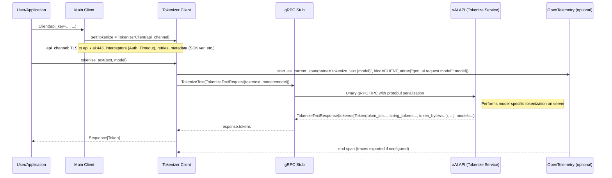

# High-Level Design: Tokenization Workflow (#18)

## Overview

The Tokenization workflow in the xAI Python SDK enables users to tokenize input text using specific models provided by the xAI API. This functionality is crucial for developers needing to understand how text is broken down into tokens for a particular model, estimate token counts for cost calculation, or preprocess inputs for other API operations like chat completions. The workflow returns a sequence of `Token` objects, each containing the token ID, string representation, and the bytes of the token.

It supports both synchronous and asynchronous interfaces, integrates seamlessly with OpenTelemetry for observability, and uses gRPC for efficient, type-safe communication with the backend service. The primary entry point is `client.tokenize.tokenize_text(text: str, model: str) -> Sequence[proto.Token]`, where `proto.Token` is defined in the protobuf schemas.

This design emphasizes reliability through built-in retries, secure authentication, and comprehensive error handling, aligning with the SDK's overall architecture.

## Components

- **Main Client (`Client` / `AsyncClient`)**: The SDK's primary entry point, responsible for initializing gRPC channels and sub-clients. During construction, it creates the `tokenize` sub-client using the API channel connected to `api.x.ai:443`.

- **Tokenizer BaseClient (`tokenizer.py`)**: An abstract base class that sets up the gRPC stub (`TokenizeStub`) for the Tokenize service using the provided gRPC channel.

- **Tokenizer Client (`sync/tokenizer.py` & `aio/tokenizer.py`)**: Concrete synchronous and asynchronous clients inheriting from `BaseClient`. The `tokenize_text` method:
  - Instruments the operation with an OpenTelemetry span named `"tokenize_text {model}"` of kind `CLIENT`, including the attribute `"gen_ai.request.model"`.
  - Constructs a `TokenizeTextRequest` protobuf message with `text` and `model` fields (optionally `user`).
  - Invokes the unary gRPC RPC `TokenizeText` via the stub.
  - Returns the `tokens` field from `TokenizeTextResponse` as a sequence of `Token` objects.

- **Protobuf Definitions** (from `proto/v5` or `v6/tokenize_pb2`):
  - `TokenizeTextRequest`: Fields include `text` (str, required), `model` (str, required), `user` (str, optional).
  - `TokenizeTextResponse`: Fields include `tokens` (repeated `Token`), `model` (str, echoed back).
  - `Token`: Fields include `token_id` (int64), `string_token` (str), `token_bytes` (bytes).

- **gRPC Infrastructure**:
  - **Channel Configuration**: Secure TLS connection with options for large messages (20 MiB limit), keepalive pings, retries (5 attempts on `UNAVAILABLE` with exponential backoff), and service config JSON.
  - **Interceptors**: `AuthInterceptor` injects `Authorization: Bearer {api_key}` into metadata; `TimeoutInterceptor` enforces RPC deadlines (default 27 minutes).
  - **Metadata**: Includes SDK version (`xai-sdk-version`), Python version, and user-provided metadata.

- **Telemetry (`telemetry/`)**: Optional integration creating spans for tracing tokenization requests, exportable to console or OTLP backends. Captures GenAI-specific attributes for monitoring.

- **Types and Utilities**: Directly uses protobuf messages for type safety; no additional Pydantic wrappers for this service.

## Sequence Diagram

## Additional High-Level Design Aspects

- **Sync vs. Async Separation**: The SDK maintains distinct `sync/` and `aio/` modules to support blocking and non-blocking usage patterns without mixing concerns. Shared logic in root `tokenizer.py`.

- **Resilience and Configuration**: Default retries handle transient network issues; configurable via channel options or timeouts. API key sourced from env (`XAI_API_KEY`) or constructor.

- **Error Handling**: Propagates gRPC status codes (e.g., `INVALID_ARGUMENT` for invalid model/text, `NOT_FOUND` for unknown model, `DEADLINE_EXCEEDED` for timeouts). Custom exceptions may wrap these in SDK.

- **API Versioning**: Protobuf definitions separated into `v5/` and `v6/` for backward compatibility and gradual upgrades. The SDK selects or supports multiple via imports in `proto/__init__.py`.

- **Security**: API key transmitted securely in gRPC metadata; supports insecure channels only for testing (flag). No sensitive data in tokens beyond input text.

- **Performance Considerations**: Unary RPC for simplicity; streaming not needed for tokenization. Protobuf ensures efficient serialization; large texts handled up to channel limits.

- **Integration and Extensibility**: Easily composable with other workflows (e.g., tokenize chat prompts before submission). Telemetry aligns with GenAI semantic conventions for ecosystem tools.

- **Testing and Examples**: 
  - Unit tests (`tests/sync/tokenize_test.py`, `aio/`) mock gRPC responses and verify spans/outputs.
  - Integration tests use a local mock server.
  - Examples (`examples/sync/tokenizer.py`) demonstrate interactive usage, printing token details.

- **Dependencies**: Core: `grpcio`, `protobuf`; Optional: `opentelemetry-sdk` for tracing. Minimal footprint for utility service.

This workflow exemplifies the SDK's modular design, providing a simple yet robust interface for a fundamental AI operation while leveraging the full power of gRPC and observability tools.