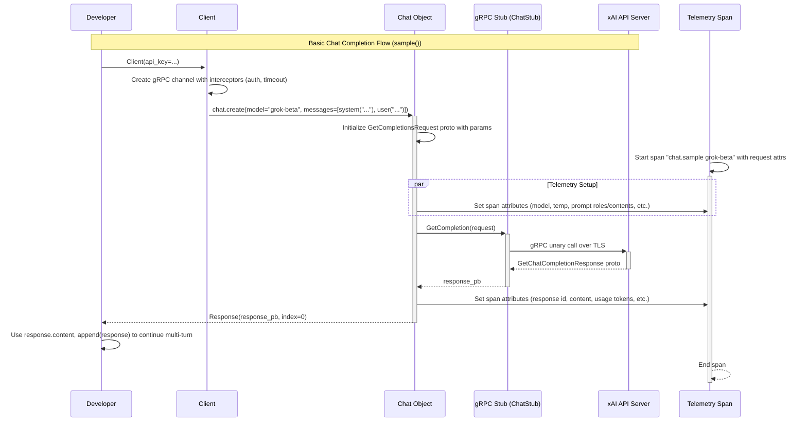
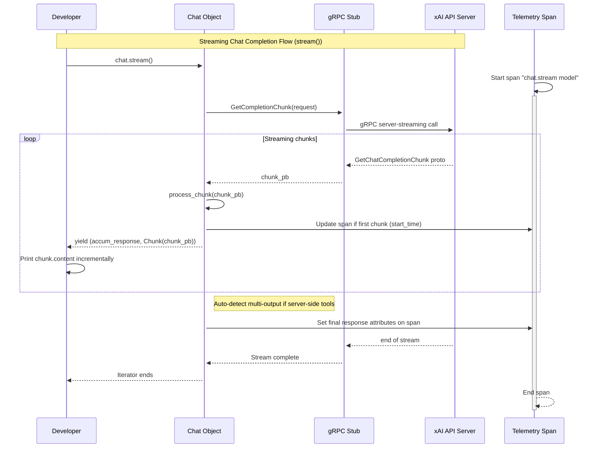

# High-Level Design: Workflow #2 - Chat Completions

## Overview

The \"Chat Completions\" workflow provides an interactive, multi-turn conversation interface with xAI's language models, such as Grok. It supports basic synchronous responses, streaming for real-time output, and batch sampling for generating multiple alternative responses. The workflow is implemented in `examples/sync/chat.py` as a CLI application that reads user input via stdin, maintains conversation history, and prints model responses to stdout until the user types 'exit'. Key capabilities include:

- **Multi-turn Conversations**: Client-side state management of message history using `append()` to build context.
- **Streaming**: Incremental response generation via gRPC server-streaming RPCs.
- **Batch Sampling**: Parallel generation of `n` responses for diversity.
- **Configuration**: CLI flags for `--stream` and `--n` (number of responses).
- **Integration**: Leverages core SDK features like tools, search parameters, reasoning effort, and telemetry.
- **Entry Point**: `client.chat.create(model, messages)` returns a `Chat` instance for interaction.
- **Proto Flow**: Builds `GetCompletionsRequest` proto, invokes `GetCompletion` (unary) or `GetCompletionChunk` (streaming) via `ChatStub`.

This design emphasizes usability for developers building chatbots, agents, or interactive apps, abstracting gRPC complexities while supporting advanced features like function calling and structured outputs.

## Components

### Core Classes
- **Client** (`src/xai_sdk/sync/chat.py` or root `client.py`): Synchronous gRPC client entry point. Manages channel creation, authentication (API key via metadata), interceptors (AuthInterceptor, TimeoutInterceptor), and sub-clients (e.g., `chat`). Initializes `ChatStub` from generated protos.
- **Chat** (`src/xai_sdk/chat.py` base, `sync/chat.py` impl): Stateful wrapper for `chat_pb2.GetCompletionsRequest`. Holds conversation `messages` (sequence of `chat_pb2.Message`), sampling parameters (temperature, tools, etc.). Key methods:
  - `create()`: Factory on Client to instantiate Chat with initial proto.
  - `append(message)`: Adds user/assistant/tool messages to history.
  - `sample()` / `sample_batch(n)`: Unary gRPC for non-streaming responses.
  - `stream()` / `stream_batch(n)`: Server-streaming gRPC for incremental output.
  - `defer()` / `defer_batch()`: Polling-based for long-running via `StartDeferredCompletion` / `GetDeferredCompletion`.
  - `parse(PydanticModel)`: Enforces JSON schema for structured outputs.
- **Response** / **Chunk**: Decorators for `GetChatCompletionResponse` and `GetChatCompletionChunk`. Provide Pythonic access to `content`, `tool_calls`, `usage` (tokens), `citations`, etc. Response accumulates streaming chunks via buffers.
- **Helpers** (`src/xai_sdk/chat.py`): `user(*content)`, `system()`, `assistant()`, `tool(name, desc, params)`, `image(url, detail)`, `file(id)` for building proto messages/tools.

### gRPC and Protos
- **Stubs/Services**: `chat_pb2_grpc.ChatStub` from compiled protos in `src/xai_sdk/proto/v5/chat_pb2_grpc.py` (or v6). RPCs: `GetCompletion`, `GetCompletionChunk`, `GetStoredCompletion`, etc.
- **Messages**: `chat_pb2.GetCompletionsRequest` (model, messages, max_tokens, tools, search_parameters, etc.), `GetChatCompletionResponse` (outputs, usage, citations), supporting multi-modal content (text, image_url, file).

### Utilities and Cross-Cutting
- **Telemetry** (`src/xai_sdk/telemetry/`): OpenTelemetry spans per call (e.g., \"chat.sample model\"), attributes include GenAI semantics (prompt/completion roles, tokens, tool_calls). Optional exporters (console/OTLP).
- **Types** (`src/xai_sdk/types/chat.py`): Pydantic-friendly aliases like `Content`, `ToolMode` (auto/none/required), `ResponseFormat` (text/json_object), `ReasoningEffort` (low/high).
- **BaseClient** (abstract in `chat.py`): Common logic for sync/async, including `_make_chat()` and proto conversions.
- **PollTimer** (`src/xai_sdk/poll_timer.py`): For deferred polling with exponential backoff/timeout.
- **Interceptors** (`src/xai_sdk/interceptors.py`): Inject auth token, enforce timeouts.

### Example Integration (from `examples/sync/chat.py`)
- Initializes `Client()`, creates `Chat` with initial system/user/assistant messages.
- Loops: Read stdin, `append(user(prompt))`, invoke `sample()`/`stream()`/`sample_batch()` based on flags, print response(s), `append(response)` for history.
- Demonstrates all modes: basic (n=1, no stream), batch (n>1, no stream), streaming (n=1, stream), batch-streaming.

## Sequence Diagrams

### Basic Non-Streaming Flow (sample() for Multi-Turn Chat)

### Streaming Flow (stream() for Real-Time Responses)

## Other High-Level Design Aspects

### Conversation Management
- **Stateful Client-Side**: `Chat.messages` tracks history (roles: user/assistant/system/tool). `append()` supports `chat_pb2.Message` or `Response` objects, converting to proto seamlessly.
- **Continuation & Branching**: `previous_response_id` loads server-stored history (if `store_messages=True`). `get_stored_completion(id)` / `delete_stored_completion(id)` for persistence.
- **Encrypted Content**: `use_encrypted_content=True` for ZDR compliance, passes reasoning traces without storage.

### Advanced Features
- **Tools & Agentic Flows**: Client tools via JSON schema (`tool()`), server-side (web_search, code_execution via `tools.py`). `tool_choice`, `parallel_tool_calls`, `max_turns` for agents.
- **Search & RAG**: `search_parameters` (mode=auto/on, sources=web/x/news, dates) integrates real-time data with citations/inline_citations.
- **Reasoning Models**: `reasoning_effort` (low/high) controls compute/tokens for complex tasks.
- **Structured Outputs**: `response_format` or `parse(Model)` with Pydantic for type-safe JSON extraction.
- **Multimodal**: Messages support `image(url/base64, detail=low/high/auto)` or `file(id)` for vision/file analysis.
- **Sampling Controls**: `temperature`, `top_p`, `seed` (deterministic), `stop` sequences, `logprobs`.

### Reliability & Observability
- **Retries/Timeouts**: BaseClient defaults (5 retries on UNAVAILABLE, exp backoff, 15min timeout). Configurable via channel options.
- **Error Propagation**: gRPC statuses (e.g., DEADLINE_EXCEEDED, INVALID_ARGUMENT) wrapped in exceptions with details.
- **Telemetry Details**: Spans capture sensitive data optionally (env var disable); includes tool_calls JSON, citations, server-side tool usage.
- **Versioning**: Protos separated in `proto/v5/` vs `v6/`; SDK imports dynamically or via config for API evolution.

### Trade-offs & Extensibility
- **gRPC Choice**: Efficient streaming/bidirectional, typed protos, but heavier deps (grpcio). vs. REST: better for high-throughput chat.
- **Sync vs Async**: Separate modules avoid mixing; shared base reduces duplication.
- **Client-Side State**: Simplifies API but grows memory for long convos; server-side via stored IDs mitigates.
- **Extensibility**: Easy addition of tools/search via params; Pydantic integration for custom schemas.

This design balances simplicity for basic use with power for production agents, aligning with SDK goals of robustness and observability.