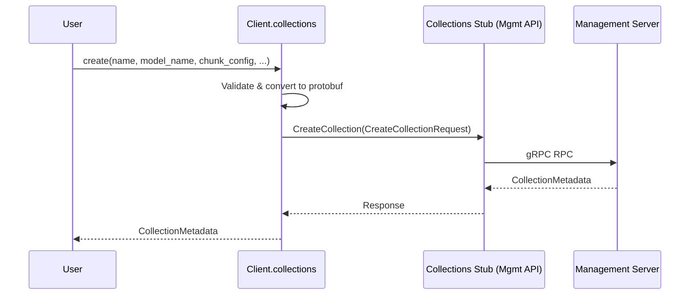
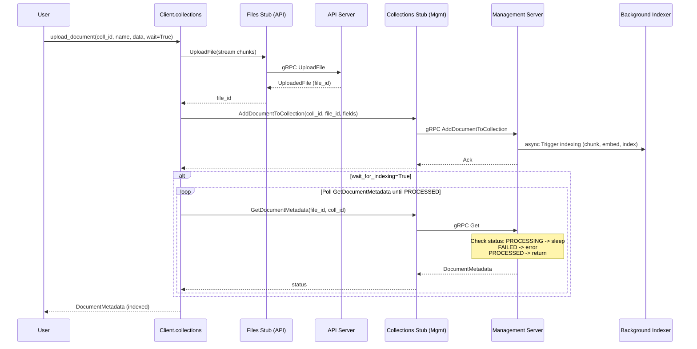
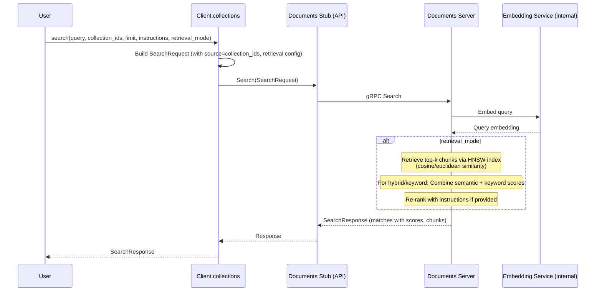

# High-Level Design of Collections Management Workflow

## Overview

The Collections Management workflow in the xAI Python SDK provides a comprehensive interface for managing vector collections used in retrieval-augmented generation (RAG) and semantic search applications. It allows developers to create, configure, and maintain collections of documents that are automatically chunked, embedded using specified models (e.g., grok-embedding-small), indexed with HNSW for efficient similarity search, and queried via semantic, keyword, or hybrid retrieval modes.

Key features include:
- Configurable chunking (character or token-based with overlap).
- Custom field definitions for document metadata with constraints (required, unique, inject into chunks).
- Asynchronous document processing with optional polling for completion.
- Integration with Files API for uploads and Documents service for search.
- Support for batch operations and pagination.
- Metrics like cosine, euclidean for vector similarity.

This workflow is essential for building knowledge bases, document search engines, and agentic systems that leverage external data.

The entry point is `client.collections.create(...)`, but the full lifecycle includes upload, search, etc., as demonstrated in `examples/sync/collection.py`.

## Components

### Core Classes and Modules
- **Client (in sync/collections.py or aio/collections.py)**: Synchronous/asynchronous client inheriting from BaseClient, exposing methods for all operations.
- **BaseClient (in collections.py)**: Initializes gRPC stubs:
  - `_collections_stub`: For collection CRUD and document management (requires management_api_channel).
  - `_documents_stub`: For search operations (api_channel).
  - `_files_stub`: For file uploads (api_channel).
- **Proto Definitions**: 
  - `proto/v*/collections_pb2.py`: Messages like CreateCollectionRequest, CollectionMetadata, DocumentMetadata.
  - `proto/v*/documents_pb2.py`: SearchRequest, SearchResponse.
  - `proto/v*/files_pb2.py`: UploadFile.
  - Shared types: ChunkConfiguration, IndexConfiguration, etc.
- **Utilities**:
  - Type adapters and validators using Pydantic for input dicts.
  - Conversion functions (_*_to_pb) to map Python types to protobuf enums/messages.
  - PollTimer: For waiting on async operations like indexing.
- **Integration Points**:
  - Files: Documents are backed by files; upload via streaming gRPC.
  - Chat/Tools: Collections can be used as tools for search in conversations (see workflow #4).
  - Telemetry: Traces gRPC calls if enabled.

### Architecture Layers
- **User Layer**: Intuitive methods abstracting protobuf and gRPC details.
- **Abstraction Layer**: Handles validation, conversion, polling, chunking of file data.
- **gRPC Layer**: Secure channels with auth interceptors, retries.
- **Backend Services**: Management API for collections, API for files/documents/search.

## Sequence Diagrams

### 1. Creating a Collection

This diagram shows the synchronous creation of a collection, including parameter conversion and gRPC invocation to the management server, which persists the collection config and initializes the index.

### 2. Uploading and Indexing a Document

Document upload involves two services: Files for storage, Collections for attachment and indexing. Indexing is async; polling checks status until processed or timeout/error.

### 3. Searching Collections

Search queries the Documents service, which embeds the query, performs vector search on collection indices, applies retrieval mode, and returns ranked matches with chunk content and scores.

## Other Design Aspects

### Error Handling
- gRPC errors propagated with status codes (e.g., INVALID_ARGUMENT for bad config, NOT_FOUND for invalid IDs).
- Validation: Pydantic raises on invalid inputs (e.g., conflicting chunk configs).
- Timeouts/Retries: Handled by BaseClient channel options.
- Indexing failures: Detected via status, with error messages.

### Performance Considerations
- Streaming uploads for large files.
- Pagination for lists.
- Efficient HNSW indices for fast approximate nearest neighbors.
- Optional waiting avoids busy-waiting with configurable polls.

### Extensibility
- Field definitions enforce schemas for structured data.
- Chunk injection of metadata improves retrieval relevance.
- Supports reindexing after config changes.

### Testing
- Unit tests in tests/sync/collections_test.py cover methods, edge cases.
- Integration via examples and possibly mock servers.

### Dependencies
- grpcio, protobuf for gRPC.
- pydantic for validation.
- datetime, typing_extensions.

This design ensures robust, scalable collection management integrated seamlessly with other SDK services.