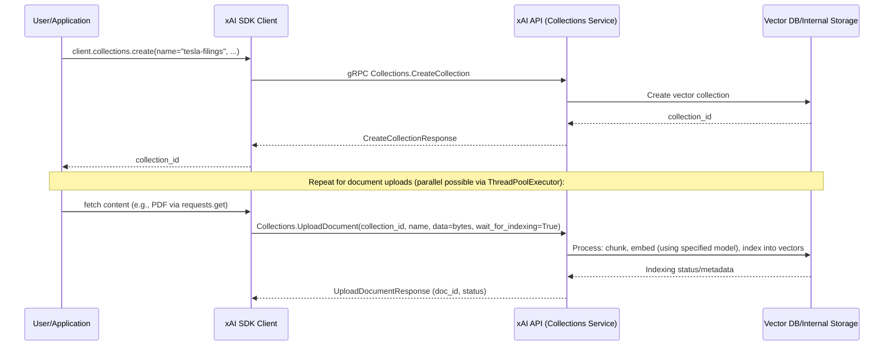
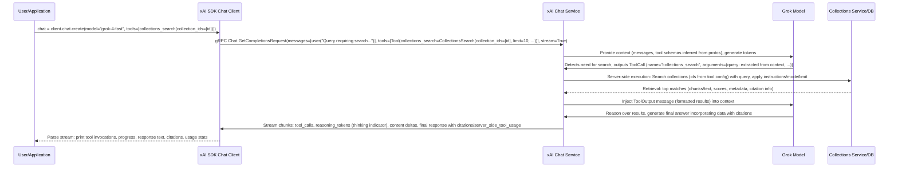

# High-Level Design: Collections Tool Calling Workflow

## Overview

The Collections Tool Calling workflow enables retrieval-augmented generation (RAG) by integrating semantic search capabilities over user-created vector collections into agentic chat conversations. This allows the model to dynamically retrieve and cite relevant information from uploaded documents to inform its responses.

From the project workflows, it uses collections as tools in agentic chat for semantic search over uploaded documents. Input includes document URLs or content for upload, collection creation parameters, and chat prompts. Output includes tool calls, search results, citations, and reasoned model responses.

The workflow demonstrates server-side tool execution, where the xAI API handles the search internally upon tool invocation by the model, simplifying client-side implementation while leveraging the collections infrastructure for private data retrieval.

Key features:
- Document upload and indexing into collections with embedding.
- Server-side `collections_search` tool configurable with collection IDs, limits, instructions, and retrieval modes (hybrid, semantic, keyword).
- Streaming chat responses with visibility into tool calls, reasoning, citations, and usage.
- Supports models like `grok-4-fast` capable of tool use.

## Components

- **Collections Module** (`src/xai_sdk/collections.py`): Provides APIs for creating collections, uploading and indexing documents. Relies on gRPC stubs from `proto/v*/collections_pb2_grpc.py` and `documents_pb2.py` for embedding and retrieval.
- **Tools Module** (`src/xai_sdk/tools.py`): Defines `collections_search` function to construct `chat_pb2.Tool` with `CollectionsSearch` proto message, specifying searchable collections and search parameters.
- **Chat Module** (`src/xai_sdk/chat.py`): Manages multi-turn conversations with tool support, including streaming, tool call handling, and response parsing (citations, server-side tool usage). Integrates with `types/chat.py` for Pydantic models.
- **Proto Layer**: `chat_pb2.py` defines `Tool` and `CollectionsSearch` for tool configuration; `documents_pb2.py` for retrieval modes like `HybridRetrieval`.
- **Client Layer**: `BaseClient` handles gRPC channels, auth, retries; service clients abstract proto interactions.
- **Examples**: `examples/sync/collections_tool.py` (and aio equivalent) showcases end-to-end: collection creation, parallel document upload from URLs, tool-enabled chat query, streaming output with citations.
- **Server Infrastructure** (opaque to SDK): xAI API services for chat (processes tool calls), collections/documents (vector search, indexing).

## Sequence Diagram: Collection Setup and Document Ingestion

## Sequence Diagram: Agentic Chat with Tool Calling

## Additional Design Aspects

- **Tool Configuration**: `collections_search` allows up to 10 collection_ids; optional custom `instructions` for ranking/relevance; retrieval modes via strings or protos (default hybrid).
- **Server-Side Benefits**: Automatic handling of tool calls (no client loop needed), parallel execution possible, secure (no client access to execution logic), integrated citations.
- **Integration with Chat Features**: Combines with streaming, stored chats, structured outputs, telemetry. Tool calls visible in responses for logging/monitoring.
- **Data Flow**: Documents uploaded as bytes/file; auto-chunked/embedded; search returns context windows suitable for model input.
- **Edge Cases**: Empty collections return no results; rate limits/quotas enforced server-side; errors propagated via gRPC status (e.g., INVALID_ARGUMENT for bad config).
- **Async Support**: Full aio equivalents in `aio/` submodule for non-blocking ops.
- **Observability**: OpenTelemetry spans for chat invocations, tool executions (with query/results attrs if enabled).
- **Dependencies**: Leverages `requests` for URL fetches in examples; protobuf/grpcio for comms; Pydantic for response validation.

This workflow exemplifies modular SDK design: separate services for data management (collections) and inference (chat), bridged via server-side tools for powerful agentic capabilities.