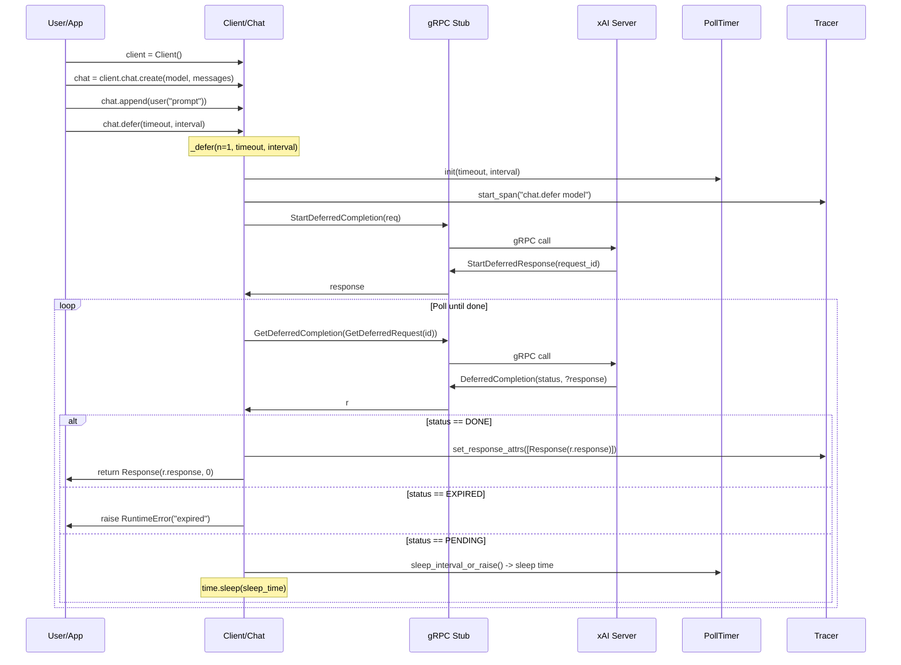

# Design: Workflow #5 - Deferred Chat

## Overview

The Deferred Chat workflow allows developers to initiate long-running chat completions that are processed asynchronously on the xAI server. The client starts a deferred request via gRPC, receives a unique request ID, and then polls the server at configurable intervals to check the status until the computation completes (DONE), expires (EXPIRED), or the client-side timeout is reached. This approach is ideal for compute-intensive tasks, such as complex reasoning or multi-turn agentic interactions with tools, where traditional synchronous or streaming calls might timeout due to network instability or long processing times.

Key features:
- **Asynchronous Processing**: Server handles the heavy computation without holding a long-lived connection.
- **Polling Mechanism**: Client polls efficiently with exponential backoff-like interval management via PollTimer.
- **Configurability**: Customizable timeout (default: 10 minutes) and poll interval (default: 100 ms).
- **Error Resilience**: Distinguishes between server expiration and client timeout; supports retries implicitly through polling.
- **Batch Support**: Via deprecated `defer_batch(n)` for multiple responses; future versions may consolidate into `defer(n)`.
- **Integration**: Fully compatible with other chat features like tools, search parameters, structured outputs, and stored messages.
- **Observability**: OpenTelemetry spans capture the entire defer operation, including request/response attributes and polling duration.

This workflow is exposed through the `chat.defer()` method on a `Chat` instance, building on the core chat creation and message appending APIs.

## Components

### Core Classes and Modules
- **Client (sync.Client / aio.AsyncClient)**: Entry point for SDK interactions. Manages gRPC channels, authentication (API key via Bearer token), retries, and sub-clients (e.g., `client.chat`). Initializes the `Chat` stub.
- **Chat (sync.Chat / aio.Chat)**: Stateful conversation handler inheriting from `BaseChat`. Maintains message history (`messages`), request parameters (model, temperature, etc.), and provides methods like `create()`, `append()`, `sample()`, `stream()`, and `defer()`. In defer flow, orchestrates the deferred request and polling.
- **PollTimer**: Simple utility in `poll_timer.py` that tracks start time, enforces total timeout, and calculates sleep durations between polls to avoid exceeding limits. Raises `TimeoutError` if polling duration exceeds `timeout`.
- **Response**: Wrapper around `GetChatCompletionResponse` proto. Provides access to content, reasoning_content, tool_calls, usage stats, citations, etc. Constructed from the final deferred completion response.

### gRPC and Protocol Buffers
- **Stubs and Methods** (from `chat_pb2_grpc.ChatStub`):
  - `StartDeferredCompletion(GetCompletionsRequest) -> StartDeferredResponse`: Initiates the deferred job, returns `request_id`.
  - `GetDeferredCompletion(GetDeferredRequest) -> DeferredCompletion`: Polls status; on DONE, includes the full `GetChatCompletionResponse`.
- **Key Protos** (in `proto/v5` or `v6/deferred_pb2.py` and `chat_pb2.py`):
  - `GetCompletionsRequest`: Core chat request with messages, model, sampling params (temperature, max_tokens), tools, search params, etc.
  - `StartDeferredResponse`: Contains `request_id` (string) for tracking the job.
  - `GetDeferredRequest`: Simple request with `request_id`.
  - `DeferredCompletion`: Includes `status` (DeferredStatus enum: PENDING, DONE, EXPIRED, INVALID) and optional `response` (GetChatCompletionResponse on DONE).
  - `DeferredStatus`: Enum for job state.
  - `GetChatCompletionResponse`: Final output with outputs (choices), usage (tokens), citations, system_fingerprint, etc.
- **Interceptors**: `AuthInterceptor` adds API key; `TimeoutInterceptor` for RPC deadlines (separate from poll timeout).

### Utilities and Telemetry
- **Tracer**: From `telemetry`, creates spans for "chat.defer {model}" with CLIENT kind. Attributes include request params (model, temperature, etc.), prompt details (messages), completion details (content, tokens), and conversation ID if set.
- **BaseClient and ProtoDecorator**: Abstract base for channel setup; decorators wrap protos for Pythonic access (e.g., `chat.messages`).

### Dependencies
- gRPCio for transport.
- Protobuf for serialization.
- Pydantic for structured outputs (if used in request).
- OpenTelemetry (optional) for tracing.

## Sequence Diagram

## Additional Design Aspects

### Flow Variations
- **Batch Deferred**: `defer_batch(n)` follows the same internal `_defer(n)` path but generates `n` responses, returning a list. Deprecated; future unification into `defer(n)` recommended.
- **Async Implementation** (in `aio/chat.py`): Mirrors sync but uses `await` for gRPC calls (`await self._stub.StartDeferredCompletion`) and `await asyncio.sleep(interval)` for polling. Suitable for non-blocking apps.
- **With Tools/Agents**: Deferred supports server-side tools (e.g., web_search), function calling, and `max_turns` for agentic loops. Polling handles multi-turn internally on server.
- **Stored Messages**: If `store_messages=True` in create, responses get IDs for later retrieval/branching via `previous_response_id`.

### Error Handling and Resilience
- **Timeouts**: Client-side via `PollTimer` (raises `TimeoutError` during sleep check); server-side expiration (raises `RuntimeError`).
- **gRPC Errors**: Handled by channel retries (default 5 on UNAVAILABLE) and interceptors.
- **Status Validation**: Explicit match on `DeferredStatus`; unknown statuses raise `ValueError`.
- **Edge Cases**: No messages in request raises `ValueError`; empty responses handled by proto validation.

### Performance Considerations
- **Polling Overhead**: Short intervals (100ms) for responsiveness but increase API calls; longer for cost savings.
- **Token Limits and Costs**: Deferred counts as standard chat completion; usage reported in final response.
- **Scalability**: Suitable for fire-and-forget tasks; not real-time (use `stream()` for that).

### Examples
See `examples/sync/deferred_chat.py` and `examples/aio/deferred_chat.py` for CLI-based usage with flags for timeout, interval, and n.

This design leverages gRPC's efficiency for short polls while offloading long computations to the server, enhancing reliability in distributed systems.