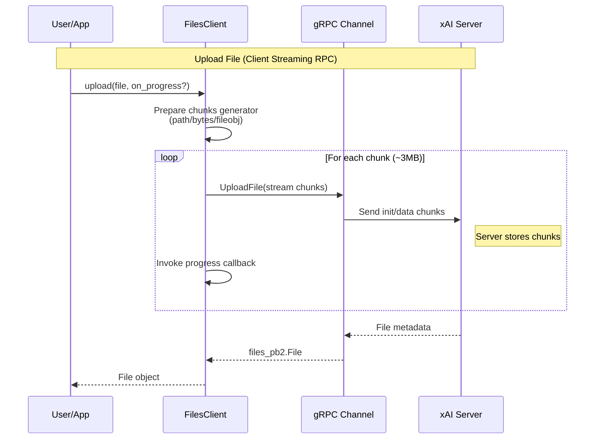
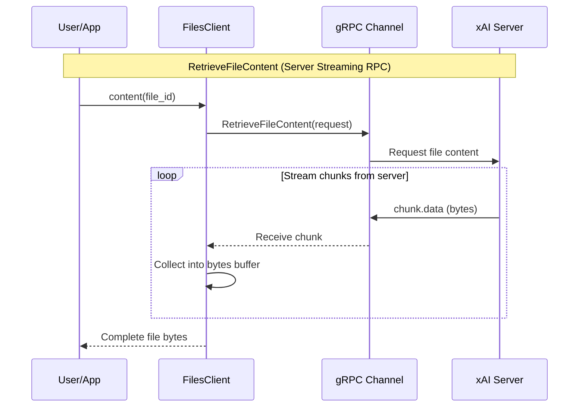
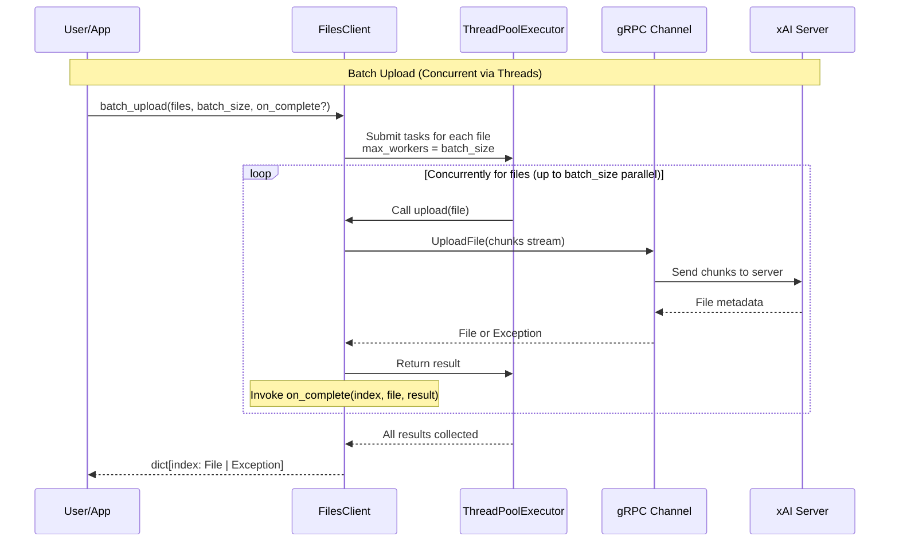
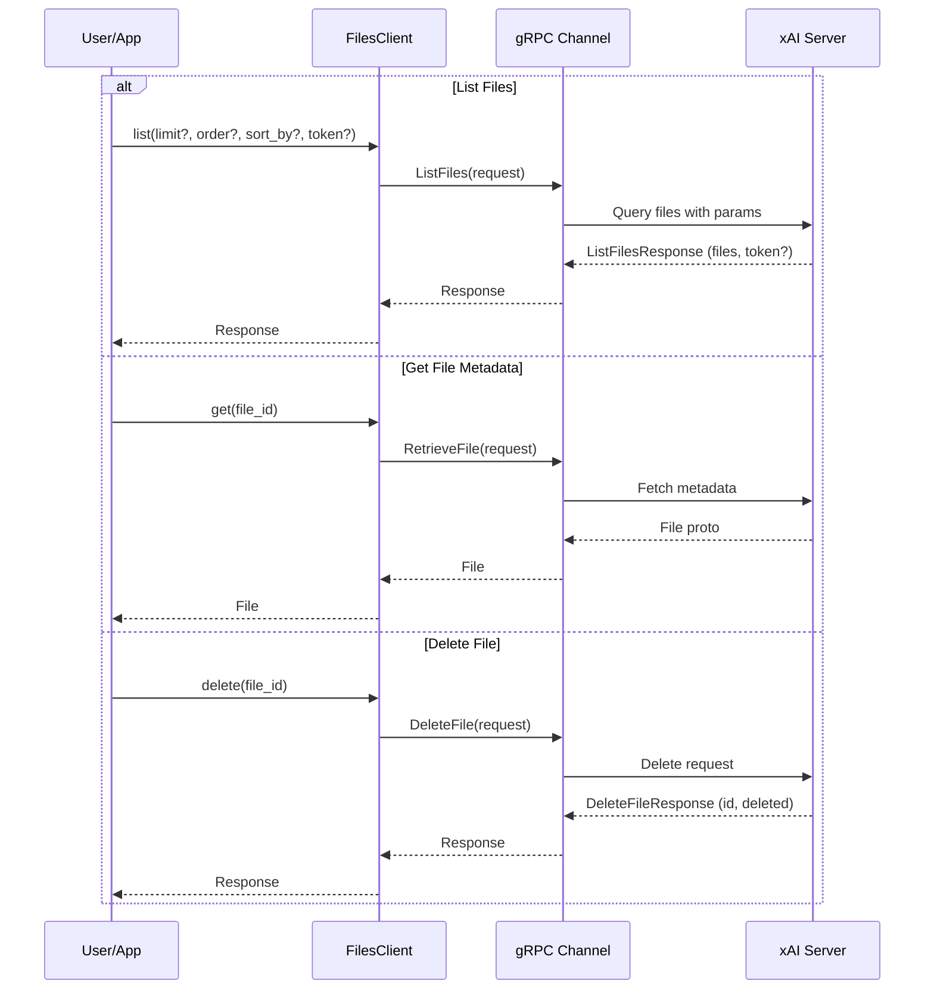

# High-Level Design: Files Management Workflow (#6)

## Overview

The Files Management workflow in the xAI Python SDK provides comprehensive file handling capabilities, allowing users to upload, download, list, retrieve metadata for, and delete files stored on xAI's servers. This functionality is crucial for applications requiring persistent storage of documents, images, or other data for subsequent processing, such as analysis in chat completions or image understanding tasks.

Key operations include:
- **Upload**: Streaming upload from file paths, bytes, or file-like objects (BinaryIO), with optional progress tracking via callbacks or tqdm-compatible objects. Supports large files without loading entire content into memory by chunking into ~3MB pieces.
- **Batch Upload**: Concurrent uploading of multiple files with configurable concurrency (default 50), handling partial failures gracefully, and per-file completion callbacks.
- **List**: Paginated listing of files with sorting (by created_at, filename, size) and ordering (asc/desc).
- **Get**: Retrieve file metadata (id, filename, size, timestamps, team_id).
- **Content**: Streaming download of file content as bytes.
- **Delete**: Remove a file by ID.

The workflow leverages gRPC for efficient, streaming communication with xAI API servers (api.x.ai or management-api.x.ai). Authentication is handled via API keys injected through interceptors. Both synchronous (via `Client.files`) and asynchronous (via `AsyncClient.files`) interfaces are provided, mirroring the SDK's dual support. Entry point: `client.files.upload(path_or_data)`.

From codebase analysis:
- Core logic in `src/xai_sdk/files.py` (base chunking, progress utils) and `src/xai_sdk/sync/files.py` / `src/xai_sdk/aio/files.py` (API methods).
- Proto definitions in `src/xai_sdk/proto/v5/files_pb2.py` and `v6/` variants for versioning.
- Examples in `examples/sync/files.py` and `aio/files.py` demonstrate usage, including progress bars and large file handling.
- Tests validate functionality, including edge cases like empty files or invalid paths.

## Components

### FilesClient and BaseClient
- **BaseClient**: Initializes gRPC stub (`FilesStub`) from channel. Provides shared utilities:
  - Chunk generators (`_chunk_file_*` sync/async): Yield `UploadFileChunk` protos (init with filename, then data chunks).
  - Progress invocation (`_invoke_progress`): Supports callable callbacks or objects with `update(n)` (e.g., tqdm).
  - Enum converters for order/sort_by to proto enums.
- **Sync Client** (`sync/files.py`): Implements blocking methods using generators and `ThreadPoolExecutor` for batch.
- **Async Client** (`aio/files.py`): Uses async generators and `asyncio` for non-blocking I/O, running file reads in executors.

### gRPC Layer and Protos
- **Services/RPCs** (from `files_pb2_grpc.py`):
  - `UploadFile`: Client-streaming (stream `UploadFileChunk` → `File`).
  - `RetrieveFileContent`: Server-streaming (`RetrieveFileContentRequest` → stream `FileContentChunk`).
  - `ListFiles`, `RetrieveFile`, `DeleteFile`: Unary RPCs.
  - `RetrieveFileURL`: Available in proto but not exposed in SDK client methods.
- **Key Messages**:
  - `UploadFileChunk`: Oneof `init` (`UploadFileInit`: name, purpose) or `data` (bytes).
  - `File`: id, filename, size, created_at/expires_at (timestamps), team_id.
  - `ListFilesRequest/Response`: limit, order (`Ordering` enum: ASCENDING/DESCENDING), sort_by (`FilesSortBy` enum), pagination_token, data list.
- Channels secured with TLS, auth via `AuthInterceptor` (Bearer token), retries/timeouts from `BaseClient`.

### Utility and Types
- **ProgressCallback**: Union of callable or `ProgressBarLike` protocol for flexible tracking.
- **BatchUploadCallback**: For per-file results in batch ops.
- **Integration**: Files referenced by ID in chat messages (`types/chat.py`: `image` or `file` attachments). Telemetry spans trace API calls if enabled.
- **Dependencies**: `grpcio`, `protobuf`; optional `tqdm` in examples.

### Error Handling and Resilience
- Input validation: File existence checks, required filename for bytes/fileobj.
- gRPC errors: Propagated (e.g., `NOT_FOUND`, `INVALID_ARGUMENT`).
- Partial batch success: Exceptions mapped in results dict.
- Retries: Inherited from `BaseClient` (exponential backoff on transient errors).

## Sequence Diagrams

### File Upload Flow

### File Content Download Flow

### Batch Upload Flow

### List, Retrieve Metadata, and Delete Flows

## Other High-Level Design Aspects

### Chunking and Streaming
- Uploads start with `UploadFileInit` (filename; purpose unused by backend).
- Data streamed in 3MiB chunks to optimize network efficiency and memory usage.
- For disk paths: Reads sequentially with `open('rb')`.
- For fileobjs: Supports seek/tell for total size estimation; streams via `read()`.
- Async: Uses `asyncio.get_event_loop().run_in_executor` for I/O to avoid blocking event loop.
- Downloads: Server streams `FileContentChunk.data` bytes; client concatenates.

### Pagination and Filtering
- `list()` supports `limit` (client-set), server-default ~100.
- `pagination_token` for cursor-based pagination.
- Sorting via `sort_by` (created_at default) and `order`.

### Concurrency and Batch Operations
- Sync batch: `ThreadPoolExecutor` with configurable `max_workers`.
- Handles exceptions per file; results dict allows checking success.
- Callbacks enable real-time progress/logging.

### Observability and Telemetry
- If enabled (`telemetry` module), API calls (e.g., UploadFile) create OpenTelemetry spans with attributes like file_id, size, chunk count.
- Traces exported to console/OTLP for monitoring upload durations, errors.

### Security Considerations
- Files associated with `team_id`; access controlled by API key permissions.
- `expires_at` field for TTL (optional, server-set?).
- No sensitive data in protos; filenames validated.

### Performance and Scalability
- Streaming prevents OOM for GB-scale files.
- Chunk size (3MiB) balances protobuf overhead vs latency.
- Retries/timeouts configurable via channel options in `BaseClient`.
- Batch concurrency prevents overload; users tune based on quotas.

### Differences: Sync vs Async
- Sync: Blocking generators, threads for batch.
- Async: `AsyncIterator` for chunks, `await` stubs, potential `asyncio.gather` for batch (inferred from structure).

### Related Workflows and Integration
- **Chat with Files (#7)**: Uploads files, attaches `file(file_id)` to messages for model analysis.
- **Image Understanding (#10)**: Files used for image uploads before vision chat.
- **Collections (#3)**: Files may feed into document embeddings (though separate).
- Protos versioned (v5/v6); SDK likely selects based on client config or features.

### Testing and Validation
- **Unit/Integration Tests**: `tests/sync/files_test.py` and `aio/` cover uploads/downloads, progress, batch failures, proto serialization.
- **Examples**: Comprehensive in `examples/sync/files.py` (tqdm progress, 48MB large file, batch with 20 files).
- **Linting/CI**: Ruff, pytest; coverage on non-generated code.

This design aligns with SDK principles: Pythonic APIs over gRPC, dual sync/async, robust error handling, optional observability.