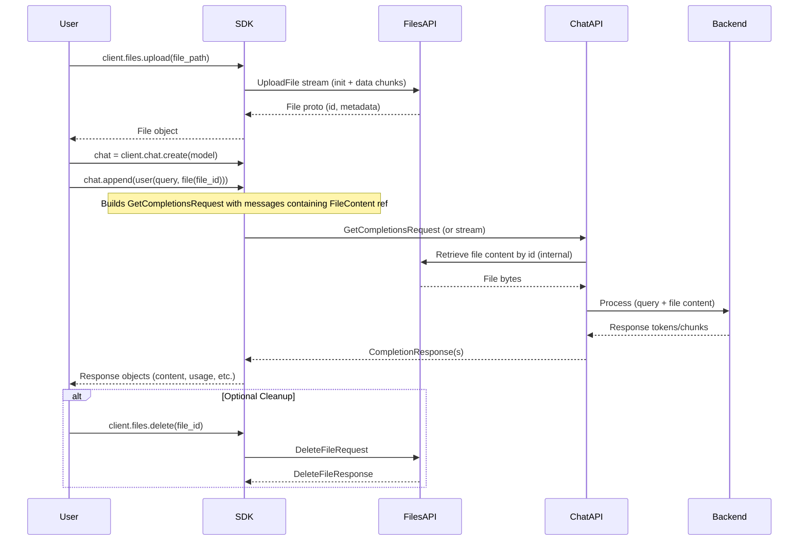

# High-Level Design: Workflow #7 - Chat with Files

## Overview

The \"Chat with Files\" workflow allows users to upload files (e.g., documents, images) to xAI's infrastructure and incorporate them into chat conversations for analysis or processing. This is particularly useful for tasks like document summarization, image description, data extraction from PDFs, or vision-based reasoning. 

The process involves two main phases:
1. **File Upload**: Using the Files API to upload file content, receiving a persistent `file_id`.
2. **Chat Integration**: Referencing the `file_id` in chat messages via `file(file_id)` content type, enabling the model to access and analyze the file alongside textual prompts.

The SDK abstracts gRPC interactions, handling chunked uploads for efficiency, message construction with file references, and response parsing including token usage that accounts for file content processing. Both synchronous and asynchronous interfaces are supported, with examples demonstrating streaming responses for real-time interaction. Files are scoped to the authenticated API key and can be deleted post-use.

This workflow leverages the stateless nature of the Chat API while maintaining conversation state client-side, with server-side file storage enabling seamless integration without embedding large content in requests.

## Components

### Core SDK Modules
- **Files Module (`src/xai_sdk/files.py`, `src/xai_sdk/sync/files.py`, `src/xai_sdk/aio/files.py`)**:
  - `Client.upload(file: Union[str, bytes, BinaryIO], ...)`: Streams file in 3MB chunks via gRPC `UploadFile` RPC. Supports progress callbacks (tqdm-compatible or custom). Returns `File` proto with `id`, `filename`, `size`, `created_at`.
  - `Client.delete(file_id)`: Removes file via `DeleteFile` RPC.
  - `Client.content(file_id)`: Downloads file bytes via streaming `RetrieveFileContent`.
  - Batch operations and listing for advanced use cases.
  - Handles large files memory-efficiently by streaming from disk or file objects.

- **Chat Module (`src/xai_sdk/chat.py`, `src/xai_sdk/sync/chat.py`, `src/xai_sdk/aio/chat.py`)**:
  - `Client.create(model, messages=..., ...)`: Initializes `Chat` object with conversation params (e.g., temperature, tools, response_format).
  - `chat.append(message)`: Adds messages, supporting `user(text, file(id))` mixing text and file content.
  - `chat.sample()` or `chat.stream()`: Invokes gRPC `GetCompletions` (or streaming variant), processing `GetCompletionsRequest` with `messages` containing `Content` of type `FileContent(file_id)`.
  - `Response` object: Provides `content`, `reasoning_content`, `usage` (including file-related tokens like `prompt_image_tokens`), `tool_calls`, `citations`.
  - Telemetry integration for tracing uploads and chat calls.

- **Types (`src/xai_sdk/types/chat.py`)**:
  - Defines `Content` union including `file(file_id: str) -> Content`.
  - Message builders: `user(*contents: Content) -> Message`.
  - Pydantic models for structured outputs, extensible to file analysis.

### Protocol Buffers (Proto Layer)
- **files_pb2**: Defines `File`, `UploadFileChunk` (init + data), `UploadFileInit` (metadata), services for upload/retrieve/delete.
- **chat_pb2**: `Message` with `content: Sequence[Content]`, `Content` oneof including `file: FileContent(file_id)`, `GetCompletionsRequest/Response`.
- Versioned in `proto/v5` and `v6` for API evolution.

### Examples and Tests
- **Examples**: `examples/sync/files_chat.py` and `examples/aio/files_chat.py` showcase upload, message construction, streaming response, usage reporting, file cleanup.
- **Tests**: `tests/sync/files_test.py`, `tests/aio/files_test.py`, `tests/chat_test.py` cover upload/download, message parsing, integration with chat.

### Interceptors and Utilities
- **AuthInterceptor**: Injects API key for all gRPC calls.
- **Telemetry**: Optional OpenTelemetry spans for file ops and chat, with attributes like `gen_ai.request.model`, file-related usage.
- **BaseClient**: Shared gRPC channel management, retries, timeouts.

## Sequence Diagram

## Additional Design Aspects

### Flow of Information
- **Upload Phase**: Client chunks file (3MiB), streams via gRPC unary-stream RPC. Server stores file, returns metadata. No direct content embedding in chat requests—reference only reduces payload size.
- **Chat Phase**: `FileContent` in message triggers server-side fetch of file bytes, tokenized/processed by model (e.g., vision for images, text extraction for docs). Response may include analysis, extractions, or generated content based on file.
- **Streaming**: `chat.stream()` yields `(Response, Chunk)` pairs; chunks accumulate content incrementally for real-time display.
- **Token Accounting**: Usage includes `prompt_image_tokens` or similar for file-derived tokens, aiding cost tracking.
- **Error Handling**: gRPC status codes (e.g., NOT_FOUND for invalid file_id, INVALID_ARGUMENT for unsupported file types). Client raises Python exceptions.
- **Security & Privacy**: Files encrypted at rest? (Assumed via gRPC TLS). Scoped to API key; ZDR (Zero Data Retention) may limit storage duration.
- **Performance**: Chunked uploads prevent memory issues; server-side caching of file processing? Model-dependent (e.g., Grok vision models for images).
- **Extensibility**: Integrates with tools (e.g., function calling post-analysis), structured outputs (parse response to schema), search/collections for RAG with files.
- **Limitations**: File size limits (server-enforced), supported formats (PNG/JPG/docs?), no in-memory updates—delete/re-upload for changes.

### Integration with Other Workflows
- Combines with **Image Understanding** (#10) for vision-specific files.
- Extends **Chat Completions** (#2) with file attachments.
- Useful in **Collections** (#3) by uploading docs for vector search.
- Supports **Structured Outputs** (#16) for extracting data from files into Pydantic models.

This design emphasizes simplicity (upload once, reference multiple times), efficiency (references vs. embeds), and flexibility (multi-modal messages).