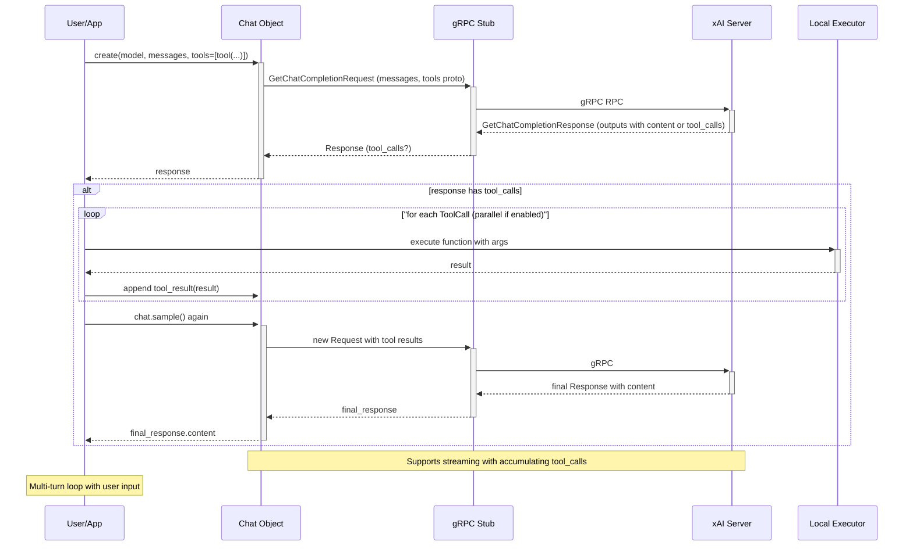

# Design Workflow 8: Function Calling

## Overview

The Function Calling workflow implements client-side tool calling in chat conversations. It allows developers to define custom functions (tools) with JSON schemas that the model can invoke by generating arguments. The SDK handles serialization to protobuf, transmission via gRPC, parsing tool calls from responses, local execution, and feeding results back as tool messages for the model to incorporate into its reasoning and final output.

This enables agentic behaviors where the model delegates tasks to client-side code, such as API calls, computations, or database queries, while maintaining conversation state client-side. It supports multi-turn interactions, streaming responses, parallel calls, and integration with other SDK features like Pydantic for structured data and OpenTelemetry for tracing.

From the codebase analysis:
- Defined in `src/xai_sdk/chat.py` with helper functions `tool()` and `tool_result()`.
- Relies on `src/xai_sdk/types/chat.py` for `ToolMode`.
- Examples in `examples/sync/function_calling.py` and `examples/aio/function_calling.py` demonstrate interactive usage with local function execution.
- Distinguished from server-side tools in `src/xai_sdk/tools.py` (e.g., `web_search()`), which execute on xAI servers.
- Proto definitions in `src/xai_sdk/proto/v*/chat_pb2.py` for `Tool`, `Function`, `ToolCall`, `Message` roles.

## Components

### Key Classes and Functions
- **BaseClient (abstract)**: gRPC stub setup for chat service.
- **Chat (sync/aio)**: Mutable conversation object; manages `GetChatCompletionRequest` proto with `messages`, `tools`, `tool_choice`, etc. Methods: `create()`, `sample()`, `stream()`, `append(msg)`.
- **tool(name, description, parameters)**: Creates `chat_pb2.Tool` with `function` spec (JSON schema in `parameters` as str). Supports dict or Pydantic `model_json_schema()`.
- **tool_result(result: str)**: Creates `chat_pb2.Message` with `role=ROLE_TOOL`, `content=text(result)`.
- **required_tool(name)**: `chat_pb2.ToolChoice` to force specific tool invocation.
- **Response/Chunk**: Decorators over proto responses/chunks; properties like `tool_calls` (list of `ToolCall` with `function.arguments` JSON), `content`, `tool_outputs`.
- **ToolCall**: Proto with `type=TOOL_CALL_TYPE_CLIENT_SIDE_TOOL`, `function=FunctionCall(name, arguments)`.

### Workflow Integration
- **tool_choice**: "auto" (model decides), "none" (disable), "required" (must call tool, or specific via `required_tool`).
- **parallel_tool_calls**: Enables multiple tool calls in one response.
- **Pydantic Support**: For schema generation (`parameters=Model.model_json_schema()`) and arg validation (`Model.model_validate_json(arguments)`).
- **Telemetry**: Spans capture tool calls with sanitized attributes (prompts, args if enabled).
- **Streaming**: `stream()` yields `(response, chunk)`; `chunk.tool_calls` for deltas; full in final `response`.
- **Error Handling**: Client executes tools; propagate exceptions or handle gracefully.

### Relevant Files
- `src/xai_sdk/chat.py`: Core logic, proto wrappers, tool helpers.
- `src/xai_sdk/tools.py`: `get_tool_call_type()` to distinguish client vs server tools.
- `src/xai_sdk/types/chat.py`: `ToolMode` type alias.
- `examples/*/function_calling.py`: Usage examples with weather tool demo.
- `tests/*/chat_test.py`: Unit tests for tool calls, parsing, etc.
- Protos: `chat_pb2.py` (v5/v6) define messages, tools, calls.

## Sequence Diagram

## High-Level Design Aspects

### Architecture Layers
- **User Layer**: App defines tools, executes logic, manages loop.
- **Abstraction Layer**: `Chat` wraps proto, handles state (messages history), convenience props (e.g., `response.tool_calls` aggregates from outputs).
- **gRPC Layer**: Serializes tools/schemas to proto; intercepts auth/timeouts.
- **Proto Layer**: `Tool.function.parameters` as JSON str; `ToolCall` for outputs.
- **Utility Layer**: JSON parsing, Pydantic optional, telemetry attrs for tool_calls.

### Design Decisions
- **Client-Side Execution**: Ensures privacy/custom logic; model only generates calls, not executes.
- **JSON Schema**: Standard for arg description/validation; compatible with OpenAI-style.
- **Mutable Chat Object**: Simplifies multi-turn; append updates request proto in-place.
- **Aggregation in Response**: Handles multi-output (n>1 or parallel tools) by indexing; `tool_calls` collects all assistant ones.
- **Streaming Support**: Deltas allow progressive tool call revelation; examples wait for full.
- **Versioning**: Works across v5/v6 protos via generated stubs.
- **Extensibility**: Easy to add tools; max limits enforced by server.

### Edge Cases and Robustness
- **No Tools Called**: Response has direct `content`.
- **Multiple/Parallel Calls**: `tool_calls` list; execute all before re-sampling.
- **Invalid JSON Args**: Client handles parsing errors.
- **Long Results**: Token limits apply to tool_result content.
- **Recursion**: Model can call tools multiple times across turns.
- **Mix with Server Tools**: SDK filters `client_side_tool` via `tools.py`.
- **Retries**: gRPC channel retries on transient errors.

### Observability and Testing
- **Telemetry**: Custom spans with `gen_ai.completion.tool_calls` JSON.
- **Tests**: Cover tool creation, call parsing, append, streaming deltas.
- **Examples**: Interactive CLI demos non-blocking execution.

This design facilitates building agents, RAG pipelines, or any tool-augmented chat apps with xAI models.