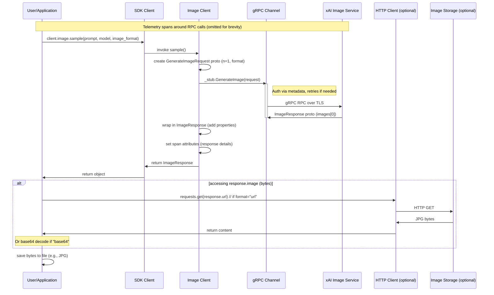

# High-Level Design: Image Generation Workflow

## Overview

The Image Generation workflow enables users to generate images from textual prompts using xAI's image generation models via the Python SDK. It supports generating a single image or a batch of images (via `n` parameter), with the output provided either as a base64-encoded string or a URL to the hosted image. The SDK abstracts the underlying gRPC communication, handling authentication, retries, timeouts, and telemetry. Generated images can be easily saved to files by accessing the `.image` property, which fetches and returns bytes (downloading from URL if necessary). This workflow is demonstrated in `examples/sync/image_generation.py`, supporting interactive prompt input and CLI flags for configuration.

Key features:
- Models like "grok-2-image"
- Configurable number of images (`n`)
- Output formats: base64 or URL
- Automatic image fetching and decoding
- Integration with OpenTelemetry for tracing
- Built-in retries and error handling

## Components

- **Main Client (`xai_sdk.Client`)**: Entry point for the SDK. Manages gRPC channels to xAI API servers, applies interceptors for authentication (API key as Bearer token) and timeouts. Initializes sub-clients including `image`.
- **Image Client (`xai_sdk.sync.image.Client`)**: Service-specific client inheriting from base image client. Provides `sample()` for single image and `sample_batch()` for multiple. Constructs `GenerateImageRequest` protobuf and invokes gRPC RPC via stub.
- **Base Image Client**: Sets up gRPC stub for `ImageStub` using the channel.
- **ImageResponse Wrapper**: Extends protobuf response with properties for `prompt` (system-rewritten), `url`, `base64`, and `image` (bytes: decodes or downloads). Supports indexing for batch responses.
- **Protobuf Messages** (`image_pb2`): `GenerateImageRequest` (prompt, model, n, format enum: IMG_FORMAT_BASE64/URL, user) and `ImageResponse` (images list with up_sampled_prompt, url or base64).
- **gRPC Layer**: Secure channel with SSL, retries on UNAVAILABLE (5 attempts, exp backoff), message size limits, keepalive.
- **Interceptors**: `AuthInterceptor` injects API key and metadata (SDK version, Python version); `TimeoutInterceptor` enforces RPC deadlines.
- **Telemetry**: Creates spans for `image.sample` or `sample_batch` with GenAI attributes (model, prompt, format, response details), exportable to console/OTLP.
- **HTTP Client (requests)**: Used to download image bytes from URL if format=URL, with SDK user-agent and timeout.
- **Async Counterpart**: Similar structure in `xai_sdk.aio.image` for non-blocking operations.

## Sequence Diagram

The following Mermaid sequence diagram illustrates the high-level flow for generating a single image (`sample()`). For batch generation (`sample_batch()`), the process is analogous but produces multiple `ImageResponse` objects from a single RPC response containing an array of images.

## Other Design Aspects

- **Authentication**: API key required, sourced from env `XAI_API_KEY` or constructor. Injected as `authorization: Bearer <key>` in gRPC metadata.
- **Error Handling**: gRPC status codes propagated (e.g., INVALID_ARGUMENT for bad prompt, RESOURCE_EXHAUSTED for quotas). Retries configured at channel level for transient errors.
- **Versioning**: Uses proto v6 (or selected version) for image_pb2. SDK version included in metadata for server-side tracking.
- **Performance**: Streaming not supported for image gen (unary RPC). Timeouts default to ~27min. Large message support up to 20MiB.
- **Security**: Sensitive data (prompts) in telemetry optional, can be disabled via config to avoid logging PII.
- **Extensibility**: Users can provide custom `user` ID for abuse monitoring. Model specified by string (e.g., "grok-2-image").
- **Testing**: Unit tests in tests/sync/image_test.py cover sample/batch, format handling, edge cases like missing url/base64.
- **Dependencies**: grpcio, protobuf, requests (for URL fetch), opentelemetry (optional).