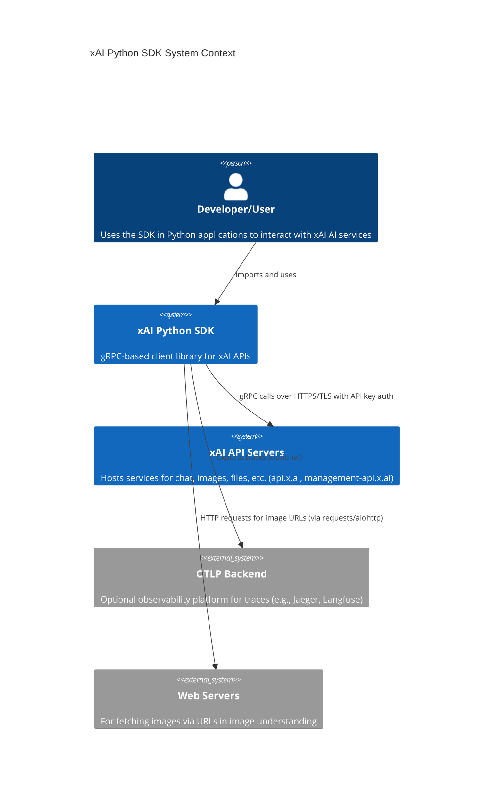
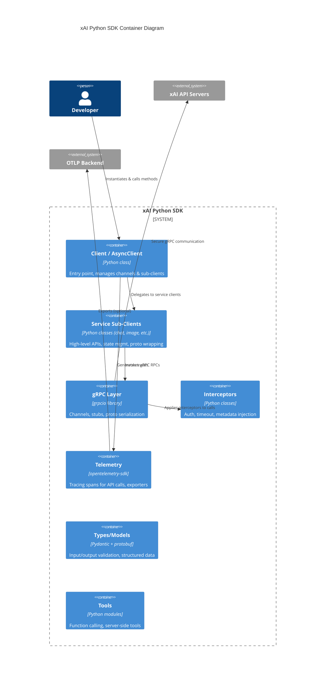

# xAI Python SDK Project Overview

## Goal
The xAI Python SDK is the official Python library for interacting with xAI's APIs. It provides a gRPC-based interface for developers to access various AI services offered by xAI, including chat completions, image generation and understanding, file management, collections, tokenization, model information, and more. The SDK supports both synchronous and asynchronous operations, making it suitable for a wide range of applications from simple scripts to high-performance async services. It emphasizes ease of use, robustness, and observability through integration with OpenTelemetry. Built for Python 3.10+, it handles authentication via API keys, manages multi-turn conversations, supports structured outputs with Pydantic, and includes features like streaming responses, function calling, and retries for reliability.

## Architecture
The SDK follows a modular, layered architecture centered around gRPC for communication with xAI's backend services. At the core is the `BaseClient` abstract class, which handles gRPC channel setup, authentication, metadata injection (including SDK and Python versions), retries, timeouts, and keepalive configurations. Concrete implementations `Client` (synchronous) and `AsyncClient` (asynchronous) inherit from `BaseClient` and provide sub-clients for specific services like chat, image, files, etc.

Key layers:
- **User Interface Layer**: High-level APIs exposed via `Client`/`AsyncClient` and service-specific clients (e.g., `client.chat`), which abstract gRPC calls into intuitive methods for multi-turn chats, streaming, etc.
- **gRPC Layer**: Uses generated protobuf stubs from proto definitions in `v5` and `v6` (supporting API versioning). Channels are secured with SSL and Bearer token auth via metadata plugins and interceptors (AuthInterceptor, TimeoutInterceptor).
- **Abstraction Layer**: Service clients manage state (e.g., chat history), wrap proto messages, and provide Pythonic interfaces. Pydantic models for inputs/outputs ensure type safety and validation.
- **Utility Layer**: Includes telemetry for OpenTelemetry tracing (optional exporters to console/OTLP), poll timers for deferred operations, interceptors for cross-cutting concerns, and types for shared models.
- **Proto Layer**: Compiled protobufs and GRPC files for API contracts, separated by version to allow evolution without breaking changes.

The SDK is dual-packaged under `sync/` and `aio/` submodules for separation of concerns, with shared code in root modules. Examples and tests mirror this structure. Dependencies include grpcio, protobuf, pydantic, and opentelemetry-sdk.

## System Context Diagram

## Key Components
- **BaseClient**: Abstract base for client setup, including gRPC channel creation, auth credentials (Bearer token via metadata), default retries (5 attempts for UNAVAILABLE with exponential backoff), timeouts (default 15min), and channel options (message size limits, keepalive).
- **Client (sync) / AsyncClient (aio)**: Main entry points. Initialize sub-clients (auth, chat, collections, files, image, models, tokenizer) and manage API/ management channels.
- **Service Clients** (e.g., chat.Client): High-level wrappers for gRPC stubs. For chat: manages conversation state, appends messages (system/user/image), supports sample/stream/deferred, function calling, structured outputs.
- **Interceptors**: AuthInterceptor (adds API key), TimeoutInterceptor (enforces RPC timeouts).
- **Proto Modules**: Generated pb2/pb2_grpc for v5/v6, defining messages and services for all APIs (chat_pb2, image_pb2, etc.).
- **Telemetry**: Integrates OpenTelemetry for tracing API calls with GenAI semantic conventions + custom attrs (prompts, responses, tokens). Supports console/OTLP exporters via optional deps.
- **Types and Models**: Pydantic-based models for chat messages, tools, structured outputs; shared types in types/.
- **Tools**: Support for function/tool calling, server-side tools (search, code exec).
- **Examples and Tests**: Comprehensive sync/aio examples for all features; unit/integration tests with pytest.

## Container Diagram

## Design Decisions
- **gRPC as Transport**: Chosen for its efficiency, built-in streaming support (e.g., for chat responses), strong typing via protobufs, and bidirectional capabilities. Trade-off: Adds heavy dependencies (grpcio ~10MB) and requires proto compilation, but enables low-latency, high-throughput interactions vs. REST/HTTP.
- **Dual Sync/Async Support**: Separate `sync/` and `aio/` packages allow blocking (simpler for scripts) and non-blocking (for web servers/async apps) modes. Trade-off: Duplicated code and maintenance overhead, mitigated by shared `BaseClient` and utils.
- **API Key Auth via Metadata**: Simple Bearer token in gRPC metadata; supports env var fallback. Secure without custom TLS certs.
- **Built-in Retries and Timeouts**: Defaults to 5 retries on UNAVAILABLE with exp backoff; configurable via channel options/service config. Ensures resilience; users can disable/customize.
- **Versioned Protos (v5/v6)**: Allows gradual API evolution and backward compatibility. SDK likely selects based on features/models.
- **OpenTelemetry Integration**: Optional, opt-in tracing with rich GenAI attrs (prompts/responses/tokens) for observability. Trade-off: Extra deps/performance cost, but valuable for production monitoring; disables sensitive data via env var.
- **Pydantic for Structured Outputs**: Enables JSON schema enforcement and type-safe responses. Trade-off: Runtime validation overhead, but improves reliability in function calling/agents.
- **Stateful Abstractions (e.g., Chat)**: Manages multi-turn history client-side despite stateless backend, simplifying usage. Trade-off: Memory use for long convos, but intuitive API.
- **Error Handling**: Exposes gRPC status codes (e.g., DEADLINE_EXCEEDED for timeouts, RESOURCE_EXHAUSTED for quotas) with detailed docs.
- **Minimal Dependencies**: Core deps focused (grpcio, protobuf, pydantic); extras for telemetry. Supports uv/pip installation.
- **Testing and Linting**: Comprehensive tests (pytest-asyncio for async), ruff for linting, coverage goals. Ensures quality; excludes protos from linting as generated.

This overview is based on analysis of README.md, pyproject.toml, source structure, and key files like client.py, sync/client.py, __init__.py.
